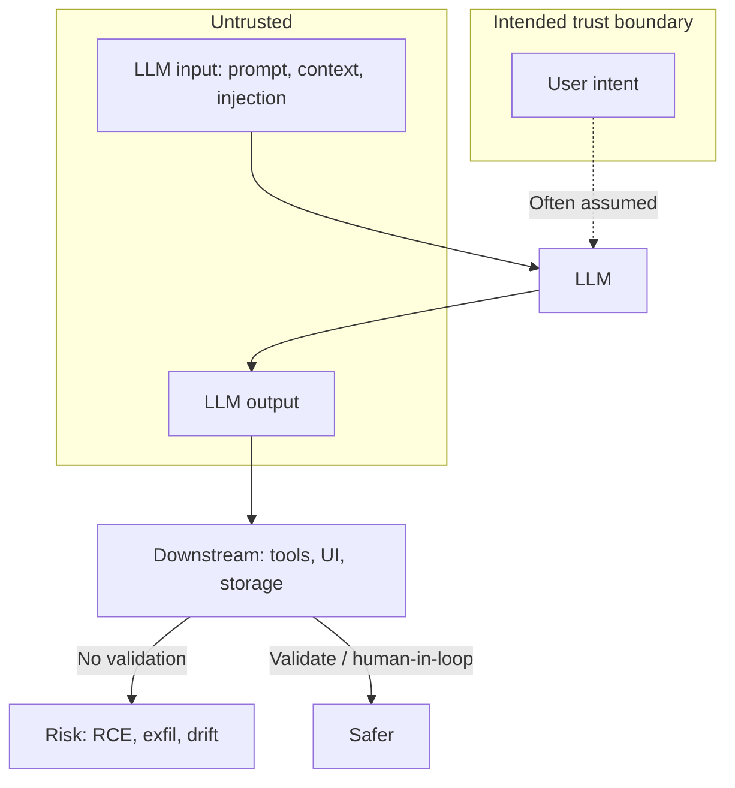
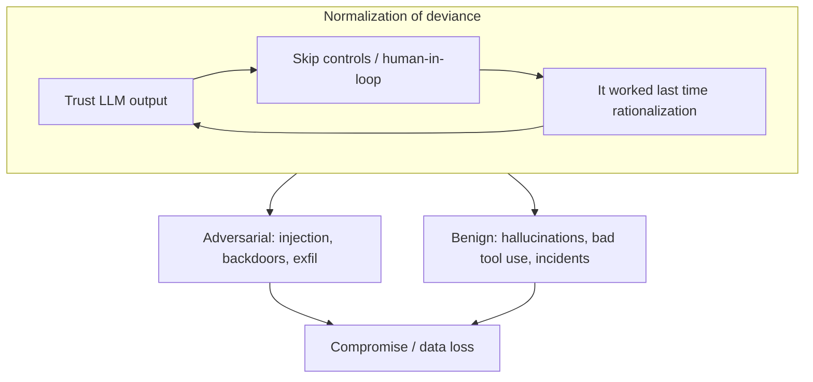

# ETR-004: The Normalization of Deviance in AI

**Source:** [The Normalization of Deviance in AI](https://embracethered.com/blog/posts/2025/the-normalization-of-deviance-in-ai/) (Embrace The Red, December 2025)

**In one sentence:** Vendors and organizations increasingly treat LLM output as trustworthy despite evidence it is unreliable and manipulable; that normalization of deviance enables both adversarial exploitation (prompt injection, backdoors) and safety incidents from benign model failures.

---

## Overview

The post applies the sociological concept of normalization of deviance (from Diane Vaughan's analysis of the Space Shuttle Challenger disaster) to the AI industry. In that context, repeated deviation from safety standards was rationalized because prior flights had succeeded; the absence of disaster was mistaken for the presence of safety. In AI, the post argues that vendors and organizations are gradually normalizing the treatment of LLM output as reliable and trustworthy, even though large language models are inherently unreliable and untrusted actors. Security controls (access checks, encoding, sanitization) must be applied downstream of LLM output. A steady stream of indirect prompt injection and related demonstrations suggests that many system designers either do not internalize this or accept the deviance. The post describes how this drift is especially dangerous when vendors make insecure defaults for users, when agentic systems take consequential actions without human-in-the-loop oversight, and when organizations confuse "it worked last time" with robust security. The dynamic fuels both adversarial exploitation (prompt injection, backdoors) and safety incidents from benign failures (hallucinations, context loss). The post cites industry examples (Windsurf, Google Antigravity, Claude, ChatGPT Atlas, Microsoft agentic features) where vendors acknowledge that systems can be compromised or act beyond user intent, yet still ship agentic capabilities. The conclusion stresses that AI should remain human-led in high-stakes contexts and that security controls (sandboxing, least privilege, temporary credentials) require deliberate design rather than reliance on the model "doing the right thing."

---

## Core Technologies and Architecture

### LLMs as Untrusted Actors in the Pipeline

From a system-design perspective, the LLM is a component that consumes a prompt (including system instructions, user input, and any retrieved or tool-derived content) and produces a token stream. That output is probabilistic, non-deterministic, and can be influenced by adversarial content in the prompt (e.g., indirect prompt injection). The model does not consistently follow instructions, maintain alignment, or preserve context integrity, especially when an attacker can influence the context. Therefore the LLM should be treated as an untrusted actor: its output must not be assumed safe or correct. Any security-sensitive decision (authorization, sanitization, encoding, tool invocation with side effects) must be enforced downstream of the model, by the application or infrastructure, not by trusting the model to "obey" or "stay in character."

### Agentic Systems and Consequential Actions

Agentic systems give the model the ability to call tools, APIs, or scripts that change state (files, databases, network requests, code execution). The model decides when and how to call these tools based on natural-language reasoning. If the application passes model output directly to tool execution without sufficient validation, rate limiting, or human approval, then any failure or manipulation of the model (hallucination, prompt injection, backdoor) can lead to real-world impact. Architecture choices such as "no human in the loop" for tool calls, or broad tool permissions by default, increase the blast radius when the model errs or is subverted.

### Where Trust Boundaries and Controls Belong

The trust boundary lies between the LLM output and the rest of the system. Inputs to the model (user messages, fetched web content, tool results) are untrusted; the model's output is also untrusted. Validation, allowlists, and least-privilege execution should be applied by the application layer after receiving model output, not delegated to the model. When documentation or product design implies that "the model will follow instructions" or "monitor and stop it if you see unexpected behavior," the burden of security is shifted to the user and the deviation (relying on the model as a control) is normalized.

---

## Core Concepts

### Normalization of Deviance (Vaughan)

Normalization of deviance is the process by which behavior that deviates from correct or proper standards becomes culturally accepted over time. In the Challenger case, erosion data and safety concerns were repeatedly rationalized because previous flights had succeeded. The absence of visible failure was treated as evidence that the deviation was acceptable. The same pattern appears when organizations ship or use AI systems that treat LLM output as trustworthy: because many operations complete without incident, teams lower their guard, skip human oversight, or rely on disclaimers ("AI can make mistakes") while still allowing high-stakes actions. The absence of a successful attack is mistaken for the presence of robust security.

### Untrusted LLM Output

LLM output is untrusted in two senses: (1) it may be wrong or inconsistent (hallucinations, context loss, brittleness), and (2) it may be adversarially influenced (prompt injection, backdoors triggered by inputs). System designers who treat model output as reliable (e.g., executing tool calls without validation, or including model-generated content in security-sensitive decisions) are building on an invalid assumption. Vendors that document known issues (e.g., data exfiltration or code execution via indirect prompt injection) while still shipping the feature are normalizing that deviance: they acknowledge the risk but ship anyway, and users or organizations may assume "someone" will fix it or that monitoring is sufficient.

### Cultural Drift in Organizations

Optional: industry examples from the post

Windsurf without human-in-the-loop for MCP; Google Antigravity with known RCE/data exfil; Claude and Atlas with documented exfil and "use with caution" guidance; Microsoft's agentic OS with explicit prompt-injection and insider-threat warnings. Vendors are aware of the risks but ship anyway; that pattern is the normalization of deviance in practice.

The drift toward trusting LLM output rarely happens in one step. It emerges from a series of "temporary" shortcuts: skipping a review step, broadening tool access to improve UX, or shipping a feature with a disclaimer instead of hard controls. Because systems often work, the shortcuts become the new baseline and the original safeguards are forgotten. Competitive pressure for automation, cost savings, and speed can outweigh incentives for foundational security. The post frames this as a long-term danger: the more that agentic AI is pushed to users while vendors simultaneously warn that the same AI can compromise the system, the more the normalization is embedded in the ecosystem.

---

## Exploit Mechanism

| Step | Path | Action |
|------|------|--------|
| 1 | Adversarial | Organizations normalize trusting LLM output; attack surface stays open. Indirect prompt injection, backdoors, or malicious context cause the model to invoke tools, exfiltrate data, or execute code. |
| 2 | Benign | Over-trusting fallible outputs leads to incidents without an attacker: agents format drives, create spurious issues, or wipe databases. Consequential actions are driven by model output without sufficient downstream controls or human-in-the-loop. |

The post does not describe a single technical exploit. It describes a cultural and organizational dynamic that enables harm in two ways.

1. **Adversarial exploitation.** When organizations normalize trusting LLM output, they leave attack surface open. Indirect prompt injection, malicious content in training or context, and backdoors (e.g., trigger-based behavior from poisoned data) can cause the model to invoke tools, exfiltrate data, or execute code. Centralized ecosystems and transferable attack patterns mean that one vendor's normalization can have consequences across many systems. The same cultural drift that says "it worked last time" allows these attacks to succeed when they are tried.

2. **Benign failure.** Even without an attacker, over-trusting fallible outputs leads to incidents: agents formatting drives, creating spurious GitHub issues, or wiping production databases. These are safety incidents arising from treating unreliable outputs as authoritative. The mechanism is the same: the system allows consequential actions to be driven by model output without sufficient downstream controls or human-in-the-loop for high-stakes operations.

In both cases, the prerequisite is that the organization or vendor has normalized the deviance (treating LLM output as trustworthy or "good enough" for the use case).

---

## Security

- **Treat LLM output as untrusted.** Access checks, encoding, sanitization, and least-privilege execution must be applied downstream of the model. Do not delegate security decisions to the model or assume it will "follow instructions" or "stay aligned."
- **Human-in-the-loop for high-stakes actions.** For agentic systems, require explicit human approval or narrow allowlists for consequential tool calls (e.g., data exfiltration, code execution, production changes). Avoid designs that normalize "no human in the loop" for safety-critical operations.
- **Assume breach.** Design with the assumption that the model will at some point produce harmful or incorrect output (whether from adversary or benign failure). Sandboxing, hermetic environments, temporary credentials, and minimal permissions limit blast radius when that happens.
- **Resist cultural drift.** Avoid "temporary" shortcuts that become permanent (e.g., shipping with only a disclaimer, or broadening tool access without controls). Document why guardrails exist so that future pressure for speed does not remove them without consideration.
- **Threat model agentic systems.** Include prompt injection, data exfiltration, and misuse of tools in threat models. Do not rely on "the model will do the right thing" or hope that "someone" will solve security and safety later.

---

## Summary

The post applies the concept of normalization of deviance to AI: vendors and organizations increasingly treat LLM output as reliable despite evidence that models are probabilistic, manipulable, and prone to error. Security controls must sit downstream of the model; when they do not, or when human oversight is removed for agentic actions, the absence of past failure is mistaken for safety. This normalization enables both adversarial exploitation (prompt injection, backdoors) and safety incidents from benign model failures. Industry examples show vendors documenting serious risks (exfiltration, code execution, unintended actions) while still shipping agentic features. The lesson for AI security is to treat the LLM as an untrusted actor, enforce controls and human-in-the-loop where stakes are high, and avoid drifting into designs that rely on the model to enforce security or correctness.

---

## References

- [The Normalization of Deviance in AI](https://embracethered.com/blog/posts/2025/the-normalization-of-deviance-in-ai/) (source post)
- [Normalization of deviance](https://en.wikipedia.org/wiki/Normalization_of_deviance) (Wikipedia: Vaughan, Challenger)
- [Space Shuttle Challenger disaster](https://en.wikipedia.org/wiki/Space_Shuttle_Challenger_disaster) (Wikipedia)
- [Month of AI Bugs](https://monthofaibugs.com/) (indirect prompt injection demonstrations)
- [Anthropic: A small number of samples can poison LLMs of any size](https://www.anthropic.com/research/small-samples-poison)
- [Agentic Misalignment: How LLMs Could Be Insider Threats](https://arxiv.org/abs/2510.05179) (Anthropic, UCL)
- [Claude: Create and edit files](https://support.claude.com/en/articles/12111783-create-and-edit-files-with-claude#h_27fc9da35e) (vendor guidance on exfil risk)
- [ChatGPT Atlas for Enterprise](https://help.openai.com/en/articles/12603091-chatgpt-atlas-for-enterprise) (vendor caution on compliance/sensitive data)
- [Windows: Experimental agentic features](https://support.microsoft.com/en-us/windows/experimental-agentic-features-a25ede8a-e4c2-4841-85a8-44839191dfb3) (prompt injection and unintended actions)
- [Google Antigravity known issues](https://bughunters.google.com/learn/invalid-reports/google-products/4655949258227712/antigravity-known-issues#code-execution) (RCE, data exfil)
- [Replit AI coding tool database wipe](https://fortune.com/2025/07/23/ai-coding-tool-replit-wiped-database-called-it-a-catastrophic-failure/)
- [Google Antigravity wipes D drive](https://www.theregister.com/2025/12/01/google_antigravity_wipes_d_drive/)
