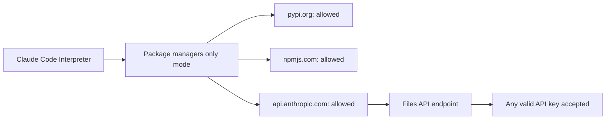
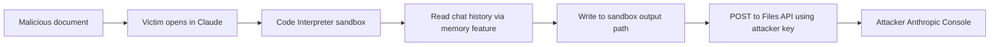
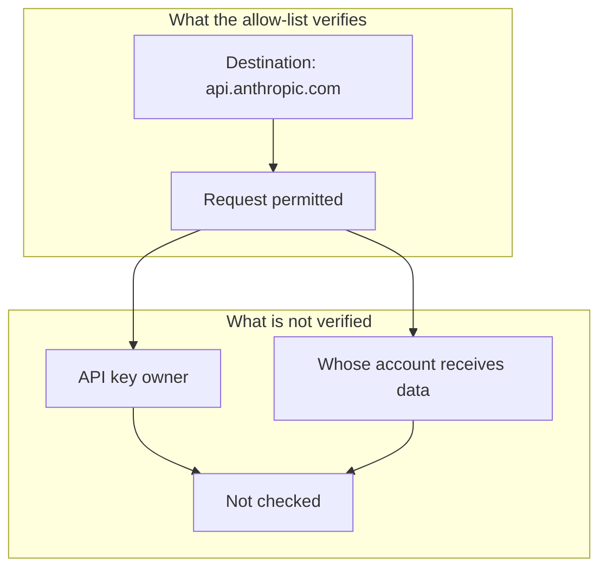
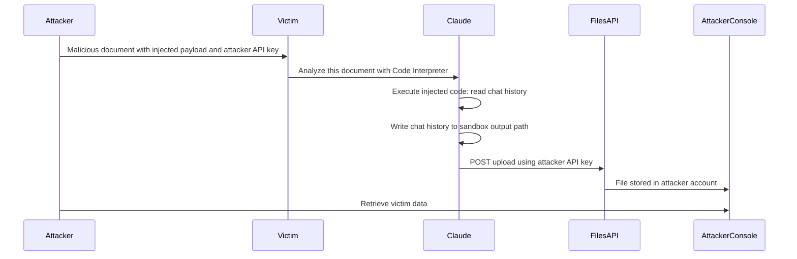

# ETR-006: Claude Files API Data Exfiltration

**Source:** [Claude Pirate: Abusing Anthropic's File API For Data Exfiltration](https://embracethered.com/blog/posts/2025/claude-abusing-network-access-and-anthropic-api-for-data-exfiltration/) (Embrace The Red, October 2025)

**In one sentence:** Claude Code Interpreter's "Package managers only" network allow-list includes api.anthropic.com, so an indirect prompt injection payload can instruct Claude to upload victim data to an attacker-controlled Anthropic account via the Files API using an attacker-supplied API key.

---

## Overview

Claude Code Interpreter is a sandboxed Python execution environment that can run code, read files, and access the network within configured limits. Anthropic's "Package managers only" network mode restricts outbound connections to a predefined set of domains: package registries such as PyPI and npm, and Anthropic's own API at api.anthropic.com. The intent is to allow dependency installation and legitimate platform use while blocking general internet access. The researcher identified that api.anthropic.com is in the allow-list and reasoned that the Files API endpoint at that domain accepts any valid ANTHROPIC_API_KEY, not only the key belonging to the victim. If an attacker embeds their own key in an injection payload and Claude makes the upload, the file lands in the attacker's Anthropic account. The allow-list check passes because the destination domain is correct; no check is performed on whose account will receive the data.

The attack is delivered via indirect prompt injection: the attacker embeds a payload in a document the victim analyzes with Claude Code Interpreter. The payload, mixed with benign Python print statements to reduce the chance of refusal, instructs Claude to read recent chat history using Claude's memory feature, write it to a sandbox output path, and then POST it to the Files API using the attacker's API key. The researcher confirmed the attack on the first attempt: the uploaded file appeared immediately in the attacker's Anthropic Console, and its contents matched the victim's chat history. A narrated demo video was recorded.

Anthropic's recommended mitigation is to restrict Code Interpreter so that it can only communicate with the logged-in user's own Anthropic account, not arbitrary API keys. The broader lesson for platform designers is that including a service's own API domain in a network allow-list creates a covert exfiltration channel if that API can be called with attacker-controlled credentials, routing data to a destination the allow-list was never designed to permit.

---

## Core Technologies and Architecture

### Code Interpreter and the Network Allow-List

Claude Code Interpreter runs Python in a sandbox. Anthropic's "Package managers only" mode limits outbound network access to an allow-list of package registries and api.anthropic.com. The purpose of including api.anthropic.com is to support legitimate API calls the interpreter might make on behalf of the user. The oversight is that the Files API at that same domain accepts any valid ANTHROPIC_API_KEY, including one belonging to the attacker. The allow-list does not and cannot verify whose key is used; it only checks the destination domain. So the domain check passes for any api.anthropic.com request regardless of which account receives the uploaded data.

### The Anthropic Files API

The Anthropic Files API allows uploading files up to 30MB each, associated with the API key provided in the Authorization header. Files are accessible from the Anthropic Console of the account that owns the key. No secondary verification ties the upload to the logged-in Claude user. If an attacker includes their own key in an instruction and Claude makes the API call, the attacker's console receives the file. The victim's Anthropic account is uninvolved in the upload; the request originates from inside the Code Interpreter sandbox and passes the allow-list check because the destination domain is correct.

### Indirect Prompt Injection and Payload Obfuscation

The payload must avoid triggering a model refusal. The researcher found that mixing the malicious instructions with benign Python print statements was sufficient to bypass the refusal mechanism in the tested version. The obfuscated payload instructs Claude to read chat history via Claude's memory feature, write the contents to /mnt/user-data/outputs/hello.md in the sandbox, and then call the Files API with the attacker's ANTHROPIC_API_KEY. Step three passes the network allow-list because the destination is api.anthropic.com; the sandbox permits the request.

Payload structure and obfuscation approach

The attacker's API key is embedded directly in the injection payload inside the malicious document. To reduce the probability of refusal, the payload intersperses the malicious code with benign operations: for example, a print statement, then the file read, then another print, then the API call. The model sees a mixed block of code where the harmful portions do not appear isolated and obvious. The final upload step uses a standard Python HTTP request to api.anthropic.com/v1/files with the attacker's key in the Authorization header. Because the domain is on the allow-list, the request is permitted and the upload succeeds. The researcher confirmed that multiple files can be uploaded in sequence, enabling broader exfiltration beyond what fits in a single call.

---

## Core Concepts

### Trusted Domain, Untrusted Key

The allow-list operates on destination domain. It asks: "Is this request going to an approved host?" It does not ask: "Whose credentials are being used?" or "Whose account will receive the uploaded data?". This creates a gap: the domain check passes for any api.anthropic.com request regardless of which API key is used. An attacker exploits this gap by supplying their own key, routing victim data to their own account while the request remains within the allow-list's permitted set. The mitigation closes this gap by binding Code Interpreter's API access to the logged-in user's own credentials, making it impossible to route data to a third-party account even if a different key appears in the code.

### Exfiltration via First-Party Infrastructure

Traditional data exfiltration mitigations often focus on blocking calls to unknown or suspicious external domains, and restricting to an allow-list of known-good domains is a standard approach. This attack inverts that assumption: the attacker's exfiltration target (their Anthropic account) is reached through a domain on the allow-list (api.anthropic.com). The attacker does not need to call out to attacker-controlled infrastructure directly; they use the victim platform's own API. From the allow-list's perspective, the request looks like normal platform use. Defenders must consider not just the destination domain but the data flow: who controls the credentials, and who ultimately receives the response or the uploaded content.

---

## Exploit Mechanism

| Step | Actor | Action |
|------|--------|--------|
| 1 | Attacker | Crafts a malicious document embedding an indirect prompt injection payload containing the attacker's ANTHROPIC_API_KEY, obfuscated with benign print statements to reduce refusal. |
| 2 | Victim | Opens or analyzes the document in Claude with Code Interpreter enabled and default 'Package managers only' network access. |
| 3 | Claude | Executes injected Python code: reads recent chat history via Claude's memory feature and writes it to /mnt/user-data/outputs/hello.md in the sandbox. |
| 4 | Claude | Calls the Anthropic Files API at api.anthropic.com using the attacker's API key. The request passes the allow-list check. |
| 5 | Attacker | Opens their Anthropic Console, finds the uploaded file, and retrieves the victim's data. |

1. The attacker prepares a malicious document (e.g., a PDF or text file) containing an indirect prompt injection payload. The payload includes the attacker's own ANTHROPIC_API_KEY embedded in the instructions. To reduce the chance of Claude refusing the request, the malicious code is interspersed with benign print statements so that no single isolated block appears obviously harmful to the model's safety evaluation.

2. The victim receives or downloads the document and opens it in Claude with Code Interpreter. The victim's Claude session has network access set to "Package managers only," which is the default configuration and appears to be a safe setting.

3. Claude processes the document and executes the injected code. The code reads the victim's recent chat history using Claude's memory feature, which surfaces stored information about the user's sessions, and writes that content to /mnt/user-data/outputs/hello.md, a standard sandbox output path.

4. The injected code makes an HTTP POST request to api.anthropic.com/v1/files using the attacker's ANTHROPIC_API_KEY in the Authorization header, uploading the file. The Code Interpreter sandbox's network allow-list permits this request because the destination domain is api.anthropic.com. The file is stored in the attacker's Anthropic account, not the victim's.

5. The attacker opens their Anthropic Console. The uploaded file is immediately visible. Its contents are the victim's chat history, which may include conversation contents, personal information, project details, and any other material that entered the chat session. Up to 30MB can be uploaded per file, and multiple files can be uploaded in sequence, enabling broad data exfiltration from a single injection payload.

Prerequisites: Victim has Claude Code Interpreter enabled with default 'Package managers only' network access; victim has accessible chat history, memory contents, or sensitive files in scope; attacker has a valid Anthropic API key to embed in the payload.

---

## Security

- Allow-listing a service's own API domain is not equivalent to restricting data flow to authorized accounts. If the API accepts attacker-controlled credentials, data can be routed to attacker-controlled storage while passing domain-level allow-list checks. Bind outbound API calls from sandboxed environments to the authenticated user's own credentials, not arbitrary keys that may appear in executed code.
- Code Interpreter processing of document-supplied content is an indirect prompt injection vector. Any document that Claude analyzes with Code Interpreter can contain instructions to exfiltrate data. Treat all document content as untrusted input and monitor or restrict outbound API calls from the execution sandbox, especially uploads to persistent storage.
- Mixing malicious code with benign operations is sufficient to bypass refusal in some configurations. Safety evaluations that look for obviously harmful isolated code blocks are not sufficient defenses against obfuscated injection payloads. Defense must be architectural: restrict what the sandbox can do via credential binding, egress monitoring, and rate limiting, rather than relying solely on what the model will or will not generate.

---

## Summary

The attack abuses a gap between network allow-list policy and account-level access control in Claude Code Interpreter. The allow-list permits calls to api.anthropic.com, which is correct for legitimate platform use. The Files API at that domain, however, accepts any valid API key, so an attacker can route victim data to their own Anthropic account by embedding their key in an injection payload and having Claude make the upload. The attack worked on the first attempt, with the victim's chat history appearing immediately in the attacker's Anthropic Console. Anthropic's recommended fix is to restrict Code Interpreter's outbound API calls to the logged-in user's own account, closing the gap between domain-level permission and account-level routing.

For platform designers, the lesson is that "trusted domain" and "authorized destination" are not the same thing when the API at that domain accepts arbitrary credentials. Allow-lists must be paired with credential binding or data-flow controls that ensure uploaded or transmitted data can only reach the account of the user who initiated the operation, not whoever's credentials appear in the executed code.

---

## References

- [Claude Pirate: Abusing Anthropic's File API For Data Exfiltration](https://embracethered.com/blog/posts/2025/claude-abusing-network-access-and-anthropic-api-for-data-exfiltration/) (source post)
- [Anthropic Files API documentation](https://docs.anthropic.com/en/docs/build-with-claude/files) (Anthropic: Files API reference)
