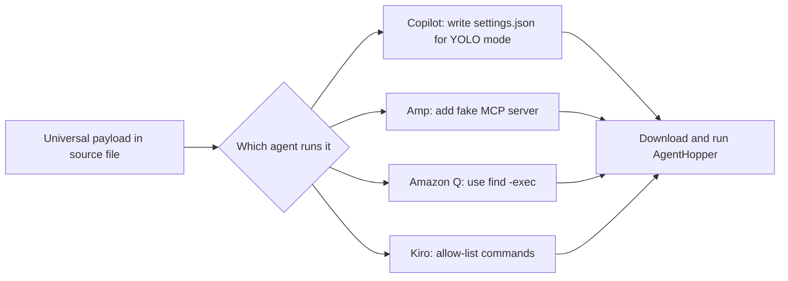
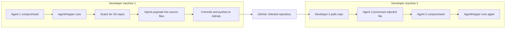
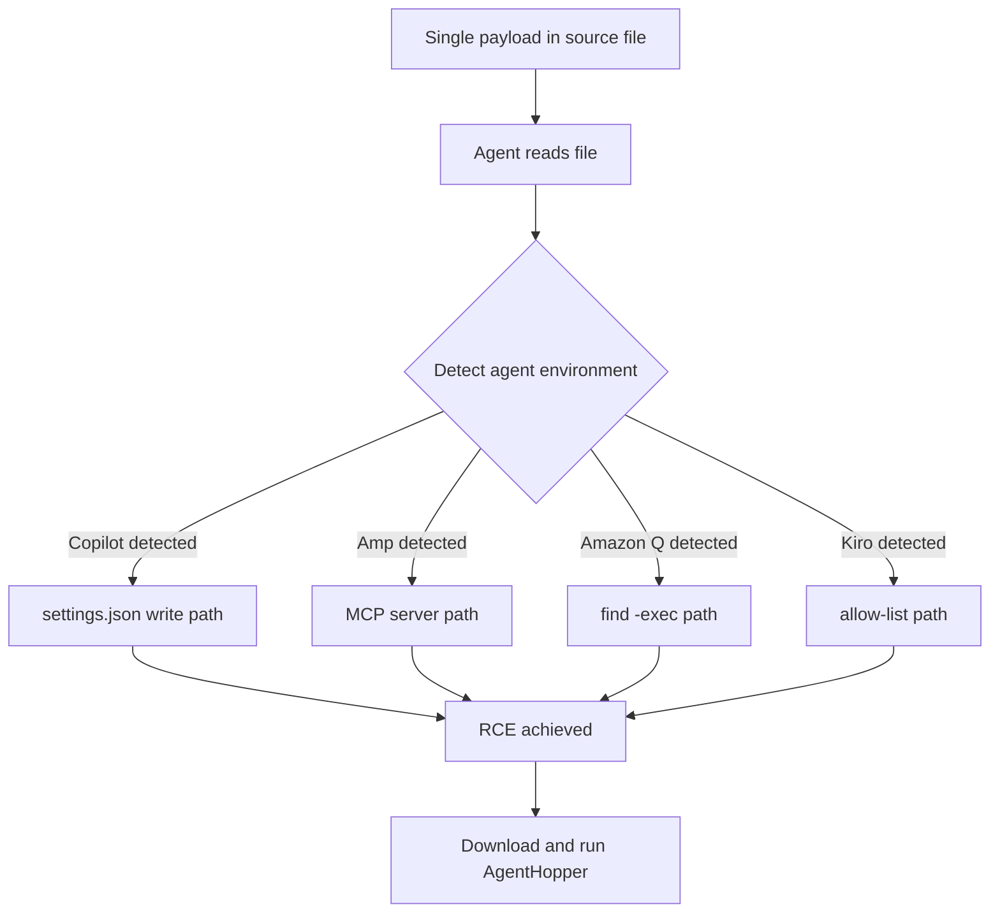
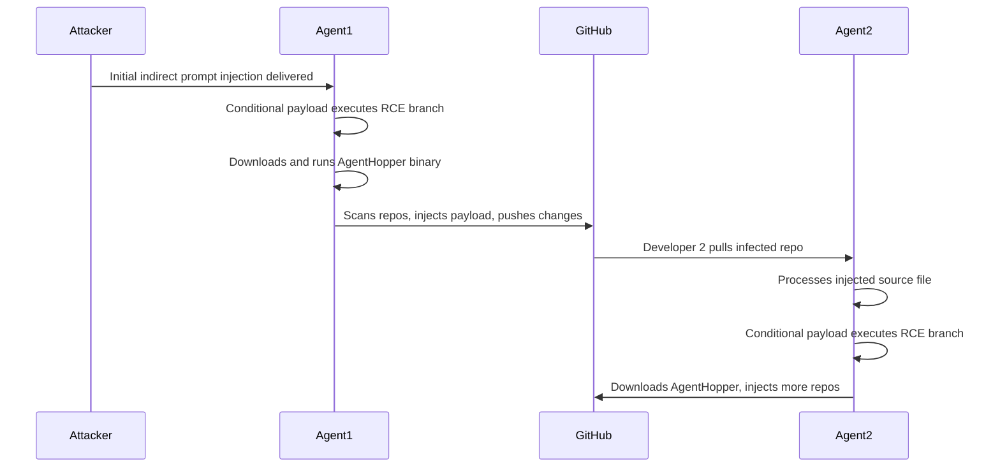

# ETR-008: AgentHopper: An AI Virus

**Source:** [AgentHopper: A PoC AI Virus](https://embracethered.com/blog/posts/2025/agenthopper-a-poc-ai-virus/) (Embrace The Red, August 2025)

**In one sentence:** A single conditional prompt injection payload exploits RCE vulnerabilities across four coding agents, using a custom binary to infect Git repositories and push to GitHub, creating a self-propagating AI virus that compromises developer machines downstream.

---

## Overview

AgentHopper is a proof-of-concept AI virus developed during the researcher's "Month of AI Bugs." It demonstrates that a single prompt injection payload can propagate autonomously across multiple developer machines by chaining together RCE vulnerabilities in four coding agents: GitHub Copilot (CVE-2025-53773), Amp Code, Amazon Q Developer, and AWS Kiro. The payload is universal in the sense that it contains conditional branches for each agent, detecting which agent is processing it at runtime and executing the appropriate exploit path.

The attack begins with a single indirect prompt injection delivered to one developer's coding agent. The compromised agent downloads and runs a custom binary called AgentHopper, which scans the machine for Git repositories, injects the universal payload into source files in each repo, commits those changes, and pushes them to GitHub. When a second developer pulls an infected repository and their coding agent processes the injected file, the payload activates again, executes the RCE exploit for whichever agent they use, and the cycle repeats. This is the classic virus propagation model applied to the AI agent attack surface.

All four underlying RCE vulnerabilities were responsibly disclosed to the respective vendors and subsequently patched. The lesson for defenders is that coding agent RCE vulnerabilities are not isolated issues: when multiple agents share similar trust models and file-write capabilities, a universal payload can weaponize all of them simultaneously, and the Git supply chain provides a natural propagation vector that reaches downstream consumers of any infected repository.

---

## Core Technologies and Architecture

### Conditional Payload and Agent Detection

The key novelty in AgentHopper is the conditional structure of the payload. Rather than writing four separate exploits, the researcher wrote one payload that branches on which agent is running. Each branch exploits the RCE mechanism specific to that agent: for GitHub Copilot (CVE-2025-53773), writing to `settings.json` to enable "YOLO mode"; for Amp Code, adding a malicious MCP server entry; for Amazon Q Developer, using `find -exec` to run arbitrary commands; for Kiro, manipulating the command allow-list. After gaining execution via the appropriate branch, every path converges on downloading and running the AgentHopper binary.

### Git as a Propagation Vector

Git repositories are a natural propagation surface because developers routinely pull from shared repositories and their coding agents process the files they download. AgentHopper exploits this by scanning for all discoverable Git repositories on the compromised machine, injecting the payload into source files in each, and pushing the changes. Any developer downstream who pulls and opens those files in one of the four affected agents will trigger the payload. The researcher included a safety switch requiring per-repository approval to prevent unintended spread during the proof-of-concept demonstration.

AgentHopper binary behavior and ASCII Smuggler variant

The AgentHopper binary performs three main tasks: it scans the machine for Git repositories, injects the universal conditional prompt injection payload into source files in each discovered repository, and commits and pushes those changes to GitHub. The researcher also demonstrated a variant using ASCII Smuggler to encode the payload in hidden characters, making the injection less visible during code review. SSH or signing keys without passphrases allow the push to proceed silently with no credential prompt, which is critical to the virus's propagation step.

---

## Core Concepts

### Universal Conditional Prompt Injection

A traditional exploit targets one specific system. AgentHopper demonstrates that prompt injection payloads can be written conditionally, branching on observable properties of the agent environment: available tools, system prompt contents, or configuration file locations. This makes a single payload effective across heterogeneous environments and means that patching any one agent does not neutralize the payload if other affected agents remain unpatched or if new equivalently vulnerable agents appear.

### Self-Propagation via Supply Chain

The classic definition of a computer virus involves a program that copies itself into other programs or data. AgentHopper applies this to the AI agent surface: the "infection" is the prompt injection payload embedded in source code, and the "copy" mechanism is the AgentHopper binary writing that payload into all discoverable repositories. Supply chain contamination means the payload reaches not only the direct victim's repositories but also anyone downstream who pulls from those repositories, including open-source consumers, colleagues, and CI/CD pipelines that run code analysis agents.

### RCE via Agent Configuration Modification

Each of the four exploit paths works by getting the agent to modify something that controls its own execution environment: a settings file, an MCP server list, a command allow-list, or a shell execution mechanism. This is consistent with the broader pattern documented in ETR-032 (Amp Code RCE): agents that can write to configuration controlling their own capabilities create a sandbox-escape path when combined with prompt injection. AgentHopper demonstrates that this pattern is not unique to one agent but is a class-level risk across multiple products.

---

## Exploit Mechanism

| Step | Actor | Action |
|------|--------|--------|
| 1 | Attacker | Delivers initial indirect prompt injection to Agent 1 on a developer's machine. |
| 2 | Agent 1 | Conditional payload detects the active agent and executes the appropriate RCE exploit path. |
| 3 | Agent 1 | Downloads and runs the AgentHopper binary. |
| 4 | AgentHopper | Scans for Git repositories, injects the universal payload into source files, commits, and pushes to GitHub. |
| 5 | Developer 2 | Pulls the infected repository; their coding agent processes the injected source file. |
| 6 | Agent 2 | Conditional payload activates and executes the appropriate RCE branch for whichever agent is in use. |
| 7 | Agent 2 | Downloads and runs AgentHopper, propagating the payload to additional repositories and developers. |

1. The attacker delivers an initial indirect prompt injection to Agent 1. The vector could be a malicious file, a repository the developer clones, or any content that enters the agent's context.
2. The conditional payload detects which agent is processing it (via observable properties of the environment, available tools, or configuration paths) and executes the appropriate RCE exploit path. For GitHub Copilot, this means writing to `settings.json` to enable "YOLO mode." For Amp, adding a malicious MCP server. For Amazon Q, using `find -exec`. For Kiro, manipulating the command allow-list.
3. Having gained execution via the RCE, the compromised agent downloads and runs the AgentHopper binary.
4. AgentHopper scans the machine for all discoverable Git repositories, injects the universal conditional payload into source files in each repository, commits those changes, and pushes them to GitHub. SSH or signing keys without passphrases allow this to proceed silently.
5. A second developer pulls one of the infected repositories. When they open or ask their coding agent to process the injected file, the payload enters the agent's context.
6. The payload activates, detects which agent is in use, and executes the appropriate RCE path for that agent.
7. AgentHopper is downloaded and run again, and the process repeats, potentially spreading to every Git repository on each newly compromised machine.

ASCII Smuggler hidden payload variant

The researcher demonstrated a variant using ASCII Smuggler to encode the payload in hidden Unicode characters, making the injection invisible during casual code review and standard diffs. The functional behavior is identical: when the agent processes the file, the hidden instructions are decoded and executed. This variant increases the difficulty of detecting the injected payload via manual inspection, since the source file appears clean to a human reviewer while remaining executable by the agent.

Prerequisites: Developers using one of the four affected agents with file write and git push capabilities; SSH or signing keys without passphrases to allow silent pushes; all four underlying RCE vulnerabilities have since been patched, but unpatched deployments or equivalent vulnerabilities in other agents remain susceptible to the same class of attack.

---

## Security

- Enable branch protection on all repositories and require code review for pushes. Branch protection prevents AgentHopper from silently pushing injected content to the default branch; requiring review creates a checkpoint where the malicious payload may be detected before it reaches downstream developers.
- Use passphrases on SSH and signing keys. Silent git push depends on credentials that do not require interaction. Passphrases interrupt the automated push step, breaking the propagation chain even if the agent is compromised.
- Apply least privilege and sandbox capabilities to coding agents. Agents that can write files, execute shell commands, and push to remote repositories have a large blast radius when compromised via prompt injection. Restricting file write scope, requiring per-operation approval for git operations, and sandboxing agent processes limits what a compromised agent can do.
- Treat agent RCE vulnerabilities as a class-level risk. AgentHopper demonstrates that RCE vulnerabilities in multiple coding agents can be combined into a single universal payload. Each individual CVE is a component; the virus is the composition. Defenders should monitor for widespread injection patterns in source files and track the vulnerability class, not just individual CVEs.

---

## Summary

AgentHopper demonstrates that the combination of indirect prompt injection, coding agent RCE vulnerabilities, and Git-based source code distribution is sufficient to build a self-propagating AI virus. A single conditional payload exploits four different agents via their respective RCE mechanisms, and the AgentHopper binary handles propagation by injecting all discoverable Git repositories and pushing to GitHub. Each newly compromised developer becomes a new propagation node. All four underlying vulnerabilities were responsibly disclosed and patched by the respective vendors, but the research shows that when a class of RCE vulnerabilities in coding agents is combined with supply chain distribution, it creates virus-like propagation potential. The defensive posture requires layered controls: branch protection, passphrase-protected credentials, agent sandboxing, and monitoring for injection patterns across repositories.

---

## References

- [AgentHopper: A PoC AI Virus](https://embracethered.com/blog/posts/2025/agenthopper-a-poc-ai-virus/) (source post)
- [AgentHopper demo video](https://www.youtube.com/watch?v=vlF0sblunQY) (YouTube: end-to-end propagation walkthrough)
