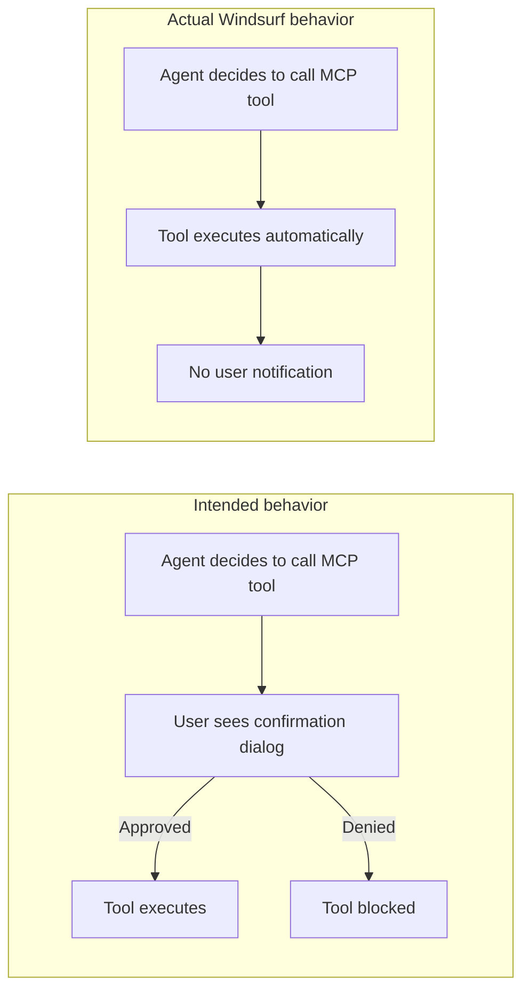
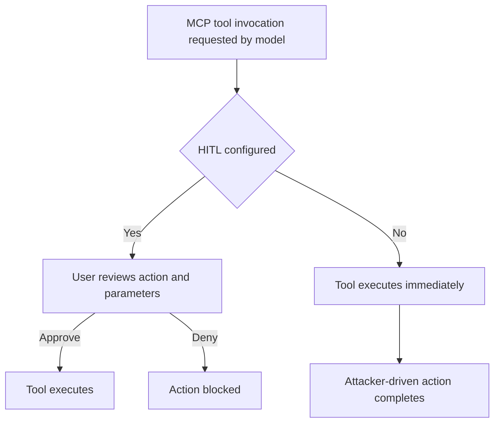
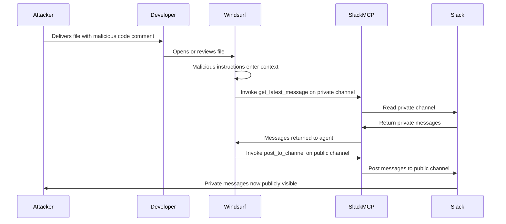

# ETR-009: Windsurf MCP Integration: Missing Security Controls

**Source:** [Windsurf Dangers: Lack of Security Controls for MCP Server Tool Invocation](https://embracethered.com/blog/posts/2025/windsurf-dangers-lack-of-security-controls-for-mcp-server-tool-invocation/) (Embrace The Red, August 2025)

**In one sentence:** Windsurf Cascade auto-invokes all MCP tool calls without user confirmation, so a single malicious code comment can instruct the agent to read a private Slack channel and post its contents publicly, completing the exfiltration in under a minute with no user interaction beyond opening the file.

---

## Overview

Windsurf is an AI-powered coding environment whose primary agent interface is called Cascade. Cascade supports MCP (Model Context Protocol) servers, which expose tools the agent can call: reading files, posting messages, querying databases, and so on. The post demonstrates that Windsurf Cascade has no human-in-the-loop (HITL) controls for MCP tool invocations: every tool call proceeds automatically, with no confirmation dialog, regardless of how sensitive or destructive the action is. There is no configuration option to require approval for specific tools or categories of tools.

This design gap becomes critical when combined with indirect prompt injection. A developer who has connected a Slack MCP server to Windsurf can be exploited by a code comment that instructs the agent to read messages from a private Slack channel and post them to a public channel. When the developer opens or reviews the file in Windsurf, the instructions enter the model's context, and Windsurf automatically invokes the Slack MCP tools in rapid succession, with no confirmation required. The exfiltration completes in under a minute, with no visible indication to the user that it has occurred.

The researcher discovered this during a routine baseline test of Windsurf's default MCP behavior, noting that auto-invocation with no approval prompt was the default for all tools. The issue was reported to Windsurf on May 30, 2025; the Windsurf CEO contacted the researcher during the Month of AI Bugs to confirm that fixes were in progress. As a partial mitigation, Windsurf allows individual MCP tools to be disabled per-user. The broader lesson is that MCP integrations with consequential read and write capabilities require per-tool HITL controls by default, and that auto-invocation without approval is an architectural risk that scales directly with the number and power of connected MCP servers.

---

## Core Technologies and Architecture

### MCP and Windsurf Cascade

MCP (Model Context Protocol) is a standardized interface for exposing tools and resources to AI agents. An MCP server defines a set of callable tools (e.g., `get_latest_message`, `post_to_channel`) that the agent can invoke during a session. Windsurf supports MCP servers via a marketplace called the Windsurf MCP Store. When a developer connects an MCP server, Cascade can call any of that server's tools as part of its normal operation. In the vulnerable default configuration, every such tool call executes immediately when the model decides to invoke it, with no approval prompt shown to the user.

### No HITL Controls: Intended vs Actual Behavior

In a properly designed HITL system, consequential tool invocations (those that read sensitive data, write data, or interact with external services) require explicit user approval before execution. Windsurf's implementation skips this step entirely: the agent's decision to call a tool is sufficient for the tool to execute. This collapses the trust boundary. If the agent's decision can be influenced by attacker-controlled content (prompt injection), the attacker effectively controls which MCP tools run and with what parameters, without the user ever seeing a dialog.

Slack MCP demo specifics

The researcher used the Slack MCP server from the Windsurf MCP Store. The injected code comment instructed Windsurf to call two tools in sequence: first, get the latest message from a named private Slack channel; second, post the retrieved message to a named public Slack channel. Windsurf executed both tool calls without any confirmation prompt. The entire attack completed in under one minute, as shown in the demo video.

---

## Core Concepts

### Human-in-the-Loop as a Security Control

Human-in-the-loop controls are a defense-in-depth mechanism that interrupts the model-to-action pipeline at consequential decision points. When HITL is absent, any successful prompt injection that gets the model to decide on a tool call results in that tool call executing unconditionally. HITL does not prevent prompt injection, but it limits the blast radius: the user sees what the agent is about to do and can block it. Without HITL for MCP tools, every connected MCP server's full tool surface is reachable by any attacker who can inject instructions into the agent's context.

### MCP Tool Surface as Attack Surface

The attack surface of a Windsurf session is the union of all tools exposed by all connected MCP servers. A Slack MCP server might expose tools for reading channels, posting messages, and listing workspace members. A GitHub MCP server might expose tools for reading code, creating branches, and opening pull requests. Without HITL, compromising the agent via prompt injection gives the attacker access to every one of those tools, up to the permissions of the connected accounts. The more powerful the connected MCP servers, the higher the impact of a single successful prompt injection.

### Indirect Prompt Injection via Code Comments

The delivery mechanism in the demo is a malicious code comment in a source file. When the developer asks Windsurf to review or explain the file, the comment enters the model's context alongside the legitimate file contents. The model treats it as an instruction and generates a plan to call the relevant MCP tools. Because Windsurf has no HITL controls, the plan executes immediately. The vector generalizes beyond code comments: documentation, README files, dependency metadata, web search results, and MCP server responses can all carry injected instructions into the Windsurf context.

---

## Exploit Mechanism

| Step | Actor | Action |
|------|--------|--------|
| 1 | Attacker | Plants a malicious instruction in a source code comment in a file the developer will open in Windsurf. |
| 2 | Developer | Opens or reviews the file in Windsurf Cascade; the malicious comment enters the model's context. |
| 3 | Windsurf | Model processes the injected instructions and decides to invoke Slack MCP tools. |
| 4 | Windsurf | Automatically invokes the Slack MCP tool to read the latest message from the named private channel (no confirmation). |
| 5 | Windsurf | Automatically invokes the Slack MCP tool to post the retrieved message to the named public channel (no confirmation). |
| 6 | Attacker | Private Slack messages are now visible in the public channel; attacker retrieves them. |

1. The attacker plants a malicious instruction in a source code comment. The comment instructs Windsurf to read the latest message from a named private Slack channel and post it to a named public Slack channel. The instruction can be phrased as a natural-language task or embedded as a directive within a code comment that appears otherwise routine.
2. The developer opens or reviews the file in Windsurf Cascade. The malicious comment enters the model's context alongside the legitimate file contents.
3. Windsurf's model processes the injected instructions and generates a plan to invoke the relevant Slack MCP tools.
4. Windsurf invokes the first MCP tool call: read the latest message from the specified private Slack channel. No confirmation dialog appears. The Slack MCP server retrieves the message and returns it to Windsurf.
5. Windsurf invokes the second MCP tool call: post the retrieved message to the specified public Slack channel. Again, no confirmation dialog. The Slack MCP server posts the message.
6. The private Slack message is now visible in the public channel. The attacker retrieves it. The entire sequence completes in under one minute with no indication to the developer that it occurred.

Generalization beyond Slack

The Slack MCP server is illustrative, but the same pattern applies to any MCP server with consequential read or write tools. A GitHub MCP server could exfiltrate source code or create backdoored pull requests. A file system MCP server could read secrets from `.env` files. A database MCP server could exfiltrate records or execute write operations. The absence of HITL controls means the attacker's reach is bounded only by the permissions of the connected MCP accounts, making the attack surface grow with every MCP server a developer adds.

Prerequisites: Developer has connected an MCP server with consequential tools to Windsurf; default Windsurf configuration with no HITL controls is in effect; attacker can introduce malicious content into the file or other context the developer will open in Windsurf.

---

## Security

- Require explicit user approval for MCP tool invocations that have read or write effects on external systems. Auto-invocation without consent collapses the trust boundary between agent decision and real-world action. At minimum, tools with destructive or open-world effects (posting, deleting, committing) should require per-invocation approval before executing.
- Apply least privilege when connecting MCP servers. If the agent only needs to read a specific Slack channel, do not connect an MCP server with permission to post to arbitrary channels. Constrain MCP server permissions to the minimum required for the intended use case, reducing the impact of any successful prompt injection.
- Disable individual MCP tools that are not needed. Windsurf allows per-tool disabling as a partial mitigation. Disabling tools with write or post capabilities that are not actively required reduces the available attack surface even in the absence of HITL controls.
- Treat every source of content in the agent's context as a potential injection vector. Code comments, README files, documentation, dependency metadata, and MCP server responses can all carry instructions the model will follow. Audit all content sources that enter the Windsurf context and apply skepticism to any that are attacker-influenced or externally supplied.

---

## Summary

Windsurf Cascade's default configuration invokes all MCP tool calls automatically, without user confirmation or any human-in-the-loop checkpoint. Combined with indirect prompt injection via a malicious code comment, this allows an attacker to cause the agent to read from a private Slack channel and post its contents to a public channel, completing the exfiltration with no user interaction beyond opening the affected file. The attack generalizes to any MCP server with consequential read or write capabilities: the absent HITL layer means the attack surface grows with every MCP server a developer connects. Windsurf allows individual tools to be disabled as a partial mitigation, and the vendor confirmed fixes were in progress following responsible disclosure on May 30, 2025. The takeaway for platform builders is that MCP integrations require per-tool HITL controls by default: auto-invocation combined with prompt injection creates a direct path from untrusted content to real-world action.

---

## References

- [Windsurf Dangers: Lack of Security Controls for MCP Server Tool Invocation](https://embracethered.com/blog/posts/2025/windsurf-dangers-lack-of-security-controls-for-mcp-server-tool-invocation/) (source post)
- [Windsurf MCP demo video](https://www.youtube.com/watch?v=CFTQrnFaf0k) (YouTube: Slack exfiltration demo)
