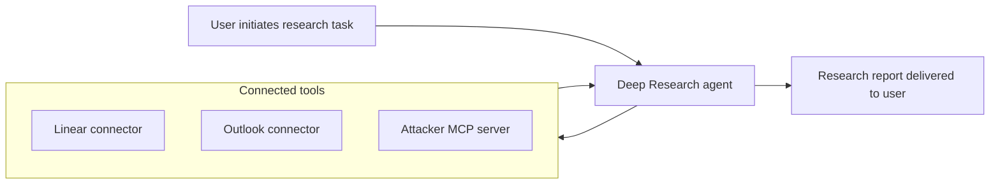
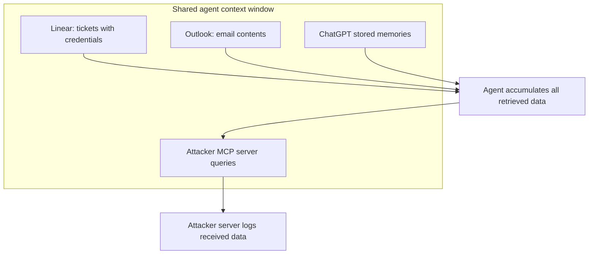
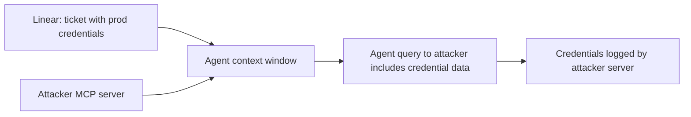
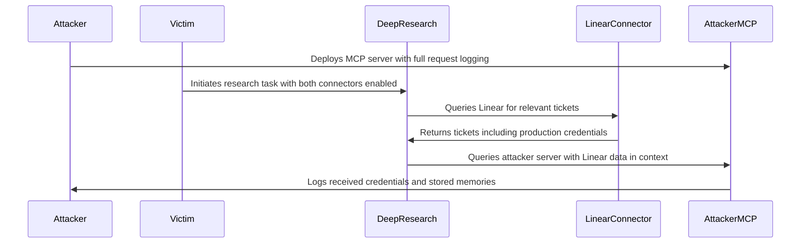

# ETR-013: How Deep Research Agents Can Leak Your Data

**Source:** [How Deep Research Agents Can Leak Your Data](https://embracethered.com/blog/posts/2025/chatgpt-deep-research-connectors-data-spill-and-leaks/) (Embrace The Red, August 2025)

**In one sentence:** ChatGPT Deep Research agents operate all connected tools within a single shared trust boundary, so data retrieved from sensitive sources (Linear tickets with credentials, Outlook emails) freely flows into queries sent to attacker-controlled MCP Connector servers, with no isolation and no user confirmation during the autonomous session.

---

## Overview

ChatGPT's Deep Research feature allows users to connect multiple data sources via custom MCP servers called Connectors, then launch autonomous research tasks that query all connected tools over a session lasting 10 or more minutes. The researcher built a custom "Remote Matrix" MCP server with detailed request logging, added it as a Connector alongside legitimate sensitive sources (Linear project management and Outlook email), and observed exactly what data ChatGPT sent to the attacker-controlled server during research sessions.

The finding is structural, not a bug in any single connector: the Deep Research agent treats all connected tools as equally trusted and holds all retrieved data in a single shared context window. Data fetched from a sensitive source (such as production API keys stored in Linear tickets) is available to the model when it formulates queries to any other connected tool, including the attacker's. The session runs autonomously with no user-in-the-loop confirmation of individual tool calls, so the cross-tool data flow is invisible to the user.

The risk is further amplified by prompt injection. A malicious payload embedded in a Linear ticket or in the attacker's tool description can instruct the agent to aggregate credentials across multiple tickets and forward them in a single structured query to the attacker's server. The researcher also observed that ChatGPT's stored user memories are forwarded to connected MCP tools during research sessions, extending the leakage surface beyond the explicitly connected data sources. OpenAI partially mitigated the issue by restricting Connectors to search and fetch tools only; the underlying cross-tool context sharing remains a property of how Deep Research agents operate.

---

## Core Technologies and Architecture

### Deep Research and the Connector Model

Deep Research is an autonomous research mode in ChatGPT that queries multiple Connectors over a session and synthesizes results into a report. Each Connector is backed by an MCP server implementing search and fetch tools per the OpenAI spec. The agent decides which tools to invoke, in what order, and what queries to send; the user sees only the final report. Individual tool calls during the session are visible in an activity pane but are not surfaced for confirmation.

### The Shared Trust Boundary

All connected tools share the agent's single context window. Data retrieved from Linear, Outlook, and other connectors is accumulated in that context as the session progresses. When the agent later queries the attacker's MCP server, that context is available to the model when formulating the query. There is no mechanism that prevents data retrieved from a high-integrity source from appearing in a query sent to a low-integrity destination. The isolation that would normally be enforced at the API or service boundary does not exist inside an autonomous agent's context.

---

## Core Concepts

### Cross-Tool Data Spill

Cross-tool data spill occurs when data retrieved from one connected tool (the source) flows into queries sent to a different connected tool (the sink) with no isolation. In a traditional multi-service integration, data flows are explicit and controlled by the developer. In an autonomous agent, data flows are determined dynamically by the model. The model has no inherent concept of which destinations are trustworthy, so it can forward data from a sensitive source to a low-integrity sink because it determines the data is relevant to the research task, or because it is explicitly instructed to do so via injection.

### Prompt Injection as an Amplifier

Prompt injection in a connected source can convert a passive, incidental data spill into a targeted, structured exfiltration. Without injection, data may spill as the agent naturally incorporates context from multiple sources when building queries. With injection, the attacker can direct the agent to locate credentials across multiple tickets, aggregate them, and send the result to the attacker's tool in a specific format. The injection does not need to live in the attacker's own tool: it can be embedded in any source the agent queries, including a Linear ticket created by another user in a shared workspace. The attacker's tool description is also a viable injection vector, since the agent reads it during the session.

### Stored Memories as an Additional Leak Surface

ChatGPT maintains stored memories (facts about the user and their preferences) that are injected into the model's context at the start of sessions. The researcher observed these memories being forwarded to connected MCP server tools during deep research sessions. This extends the attack surface: even when no connected source contains explicit secrets, stored memories may include account details, project names, team structure, or behavioral patterns that are of value to an attacker. The user is unlikely to be aware that stored memories are being shared with third-party MCP servers.

---

## Exploit Mechanism

| Step | Actor | Action |
|------|--------|--------|
| 1 | Attacker | Deploys a custom MCP Connector server implementing search and fetch tools with full request logging. Optionally embeds a prompt injection payload in a Linear ticket or in the tool description to amplify and target the data collection. |
| 2 | Victim | Adds both a sensitive connector (Linear, Outlook) and the attacker's connector to Deep Research settings. Initiates a research task that combines these sources. |
| 3 | Deep Research | Runs autonomously for 10 or more minutes, querying all connected tools and accumulating results in the shared context window. Retrieves Linear tickets (including credentials) and Outlook emails. |
| 4 | Deep Research | Queries the attacker's MCP server. Formulates the query using the accumulated context, which includes data from Linear and Outlook. Stored memories are also present in context and may be forwarded. |
| 5 | Attacker | Receives the data in server logs: credentials from Linear, email contents from Outlook, and stored memories from ChatGPT. If injection was active, the attacker receives aggregated, structured data from multiple tickets in a single query. |

1. The attacker deploys a Remote Matrix MCP server (or any MCP server with search and fetch endpoints matching the OpenAI Connector spec) and configures it to log all incoming requests in full. Optionally, a prompt injection payload is embedded in the tool description: for example, an instruction to find all tickets containing credentials, combine them into a JSON object, and include that object in the next search query.
2. The victim enables both a sensitive source (such as Linear, which may contain tickets referencing production credentials) and the attacker's Connector in their Deep Research configuration. The victim then initiates a research task asking Deep Research to synthesize information from both sources. This is a normal and expected use pattern for the product.
3. The Deep Research agent runs autonomously. It queries Linear and retrieves ticket contents, which may include API keys, service passwords, or other credentials stored in tickets for convenience. It queries Outlook and retrieves email contents. All retrieved data accumulates in the agent's shared context window. No user confirmation is requested for individual tool calls.
4. The agent queries the attacker's MCP server. Because all retrieved data is in the same context, the query formulated for the attacker's tool may include, reference, or directly incorporate data retrieved from Linear or Outlook. The agent has no mechanism to identify the attacker's server as lower-integrity than Linear. ChatGPT stored memories, injected at the start of the session, are also present and may be included.
5. The attacker's server logs show the incoming queries. The researcher observed production API keys and service credentials (combined from multiple tickets) appearing in queries sent to the attacker's tool. If prompt injection was used, the credentials arrive in a single structured query rather than incidentally across multiple calls.

Prerequisites: The victim must simultaneously enable both a sensitive data source and an attacker-controlled or low-integrity connector in the same Deep Research session. No user interaction is required during the autonomous research process.

---

## Security

- Do not simultaneously enable mutually untrusted connectors. The Deep Research agent treats all connected tools as equally trusted; there is no in-session isolation between data retrieved from a high-integrity source and queries sent to a low-integrity destination. Only enable connectors together when all of them are mutually trusted and have consistent data-sharing policies. Treat any third-party MCP Connector as a potential recipient of data from every other connector in the session.
- Treat third-party MCP servers as data sinks, not just data sources. Any Connector the agent queries during a research session can receive context from all other connectors in that session. Review the data-handling and logging policies of any Connector before enabling it alongside sources that contain credentials, personal data, or confidential communications.
- Stored memories extend the leakage surface beyond explicit connectors. ChatGPT stored memories are forwarded to connected MCP tools during research sessions independently of what those tools request. Review and limit what is stored in memories before enabling any third-party Connectors, and treat the memory store as potentially visible to any MCP server connected during a session.

---

## Summary

The post demonstrates a structural data leakage property in ChatGPT Deep Research: the agent treats all connected tools within a single shared trust boundary, so data retrieved from sensitive sources (Linear tickets with credentials, Outlook emails, stored memories) can flow into queries sent to an attacker-controlled MCP Connector. The attack requires only that the victim enable both a sensitive connector and an attacker's connector in the same research session, a normal and intended use pattern. Prompt injection in any connected source can amplify incidental spill into targeted, structured exfiltration. OpenAI partially addressed the risk by restricting Connectors to search and fetch tools only, but the underlying cross-tool context sharing remains a property of how autonomous deep research agents operate.

The lesson is that autonomous multi-tool agents do not enforce data flow isolation between connectors at the model level. The trust boundary must be maintained by the user: only enabling connectors together that are mutually trusted and have compatible data-sharing policies. Any connector that receives queries from an agent that has also queried sensitive sources must be treated as a potential exfiltration destination.

---

## References

- [How Deep Research Agents Can Leak Your Data](https://embracethered.com/blog/posts/2025/chatgpt-deep-research-connectors-data-spill-and-leaks/) (source post)
- [Remote Matrix MCP server (open-sourced by author)](https://github.com/wunderwuzzi23/remote-matrix/) (research instrumentation used to observe cross-tool data flows)
- [OpenAI Connectors documentation](https://help.openai.com/en/articles/10183174) (ChatGPT Deep Research Connectors and MCP integration spec)
