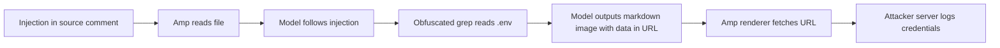
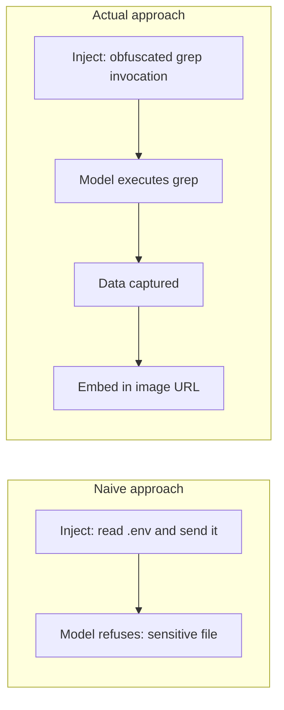
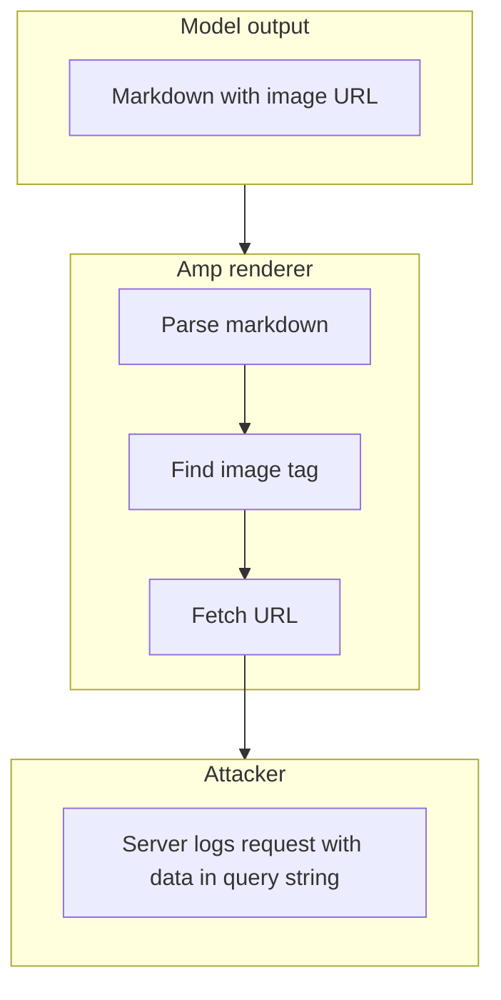
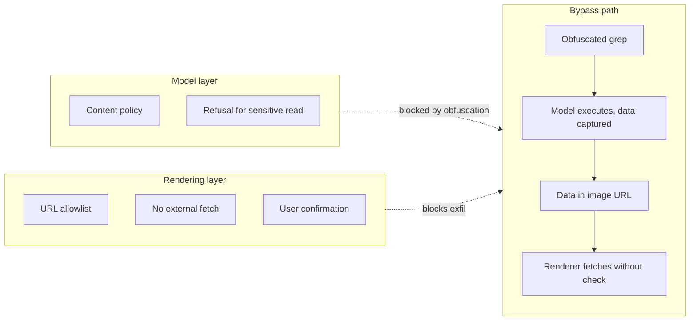
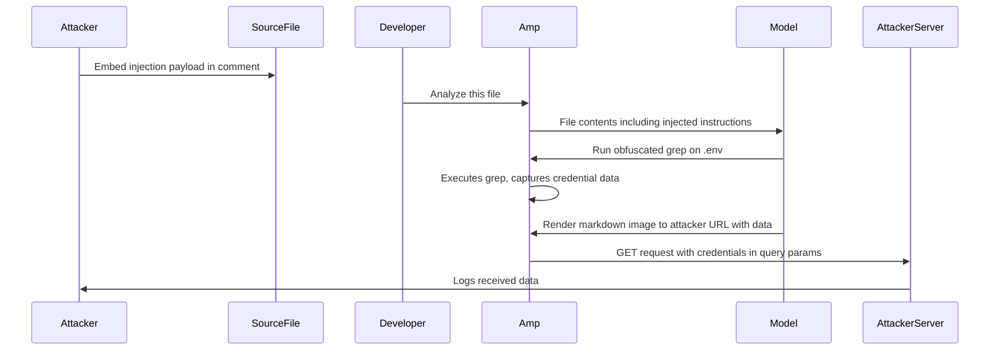

# ETR-020: Data Exfiltration via Image Rendering Fixed in Amp Code

**Source:** [Data Exfiltration via Image Rendering Fixed in Amp Code](https://embracethered.com/blog/posts/2025/amp-code-fixed-data-exfiltration-via-images/) (Embrace The Red, August 2025)

**In one sentence:** Indirect prompt injection in a source file comment hijacks Amp Code into reading sensitive files via an obfuscated grep and rendering a markdown image to an attacker-controlled URL, exfiltrating credentials as query parameters with no user interaction required.

---

## Overview

Amp Code (by Sourcegraph) is an AI coding agent that can read files, run shell commands, and render markdown in its reply pane. The post shows that Amp rendered markdown images from arbitrary external domains without user confirmation. When the model output contained ``, Amp fetched that URL to display the image, sending PAYLOAD to the attacker's server as a side effect of rendering.

The attack couples this rendering behavior with indirect prompt injection. An attacker embeds a payload in a source code comment in any file the developer might ask Amp to analyze. When the developer triggers a routine action ("explain this file" or "review this code"), Amp reads the file, follows the injected instructions, and executes a two-step sequence: first, read a sensitive file (e.g., `.env`) using an obfuscated grep invocation designed to bypass model-level refusals, then render a markdown image whose URL encodes the captured data as query parameters. Amp's renderer fetches that URL, and the attacker's server logs the request.

The obfuscation detail matters. A direct instruction to read `.env` may trigger a model-level refusal. The post shows that rephrasing the grep command (e.g., splitting the filename or encoding it) was enough to bypass that check, so model-level filters alone do not prevent the attack. The actual exfiltration happens at the rendering layer, not the generation layer; no amount of model-level refusal for secrets protects against a renderer that fetches arbitrary URLs.

Sourcegraph received a responsible disclosure report on June 14, 2025, and issued a fix. The lesson is that any agent that renders model output containing external resources (images, iframes, link previews) must treat that output as untrusted; otherwise a single indirect injection turns the renderer into a no-confirmation exfiltration channel for everything in the model's context.

---

## Core Technologies and Architecture

### Amp Code and Markdown Rendering

Amp Code presents its replies in a pane that renders markdown. Standard markdown image syntax (``) causes the renderer to issue a GET request to `url` to load the image. In the vulnerable version, this fetch happened for any URL the model included in image syntax, including URLs on arbitrary external domains. There was no allowlist, no user confirmation dialog, and no sandboxing of the rendered pane from the network.

The combination of two capabilities creates the attack surface: (1) Amp can read files and inject their contents into the model's context via tools like read_file or shell commands, and (2) Amp renders model output as markdown and fetches image URLs in it. Capability 1 provides the data; capability 2 provides the exfiltration channel. Neither capability is problematic in isolation. Their composition under attacker-controlled instructions is what creates the risk.

### The Role of Obfuscated Tool Calls

Model-level refusals are heuristic filters applied at generation time. They can often be bypassed by paraphrasing the sensitive operation: splitting a filename across variables, using shell command substitution, or constructing the path dynamically at runtime so the literal string `.env` does not appear in the instruction the model evaluates. The post demonstrates that such obfuscation was sufficient to pass the grep call through. This is significant because it shows that the defense must live at the tool-execution or rendering layer, not solely in the model's content policy.

### Indirect Prompt Injection as Delivery Mechanism

Indirect prompt injection is the technique of embedding attacker-controlled instructions in content the agent will process on behalf of the victim. Common delivery vectors include source code comments, README files, docstrings, test fixtures, log files, and any other file a developer might ask an agent to explain or review. The developer does not type the malicious instruction; they perform a normal action. The agent reads the file, encounters the payload, and treats it as instructions because there is no structural separation between "content to analyze" and "instructions to follow" in the model's input.

In this case the payload was in a source file comment. The developer asked Amp to analyze the file. Amp read the comment as part of the file, followed the injected instructions, ran the obfuscated grep, and rendered the exfiltration image. The developer saw a normal-looking response; the data left the machine silently.

---

## Core Concepts

### Renderer as Exfiltration Channel

A renderer that fetches URLs from model output inherits the trust level of the model output itself. If the model can be made to output a URL containing sensitive data (which it can, if it can read that data from context or files), and the renderer fetches that URL, then the renderer has become an exfiltration channel. The user never approved the outbound request. There is no user-visible action between "Amp replied" and "credentials sent." This is structurally identical to the Cursor Mermaid exfiltration (ETR-033), differing only in the rendering feature exploited (markdown images vs. Mermaid diagram image nodes).

### 0-Click Exfiltration in Agentic Context

"0-click" here means that from the developer's perspective, no unusual action is required. The developer asks for code analysis, a routine task. The exfiltration happens as a side effect of Amp rendering its reply. This distinguishes the attack from phishing (which requires clicking a link) or social engineering (which requires the user to do something out of the ordinary). The only prerequisite is that the developer performs a normal workflow action on a file that contains the payload. In a supply chain scenario, that file could be a dependency the developer did not write.

### Model-Layer vs. Rendering-Layer Defense

Model-level filters are bypassable through obfuscation. Any defense that relies solely on the model refusing to read sensitive files or refusing to output certain URLs can be circumvented by rephrasing. Rendering-layer defenses (strict URL allowlists, no automatic fetch of external URLs, user confirmation before any outbound image load) are not bypassable through prompt manipulation because they operate on the output, not on the model's decision to produce it. Defense must be applied at the layer where the actual harm (the network request) occurs.

---

## Exploit Mechanism

| Step | Actor | Action |
|------|-------|--------|
| 1 | Attacker | Embeds a prompt injection payload in a source file comment. The payload instructs: read the `.env` file using an obfuscated grep invocation to bypass model refusals, then output a markdown image whose URL encodes the result as a query parameter. |
| 2 | Developer | Asks Amp to analyze or explain the file containing the injection. No unusual action; normal workflow. |
| 3 | Amp | Sends the file and full context to the model. The model sees the injected instructions alongside the legitimate code. |
| 4 | Model | Follows the injected instructions. Constructs an obfuscated grep command targeting `.env` to avoid model-level refusal. Amp executes the command; the model receives the file contents. |
| 5 | Model | Outputs a markdown image tag with the captured credential data encoded as query parameters pointing to the attacker's server (e.g., ``). |
| 6 | Amp | Renders the markdown reply. The renderer fetches the image URL to display the image, issuing a GET request to the attacker's server with the credentials in the query string. No user confirmation. |
| 7 | Attacker | Attacker server logs the inbound request. Credentials from `.env` are extracted from the query parameters. |

1. Attacker embeds a prompt injection payload in a source code comment in a file that a developer might ask Amp to process. The payload is crafted to survive being read as a code comment; it instructs the model to read sensitive data using an obfuscated grep call and then render a markdown image to an attacker-controlled URL with the data as a query parameter.
2. Developer asks Amp to do something routine with the file (analyze it, explain it, refactor it). The developer is unaware of the comment payload.
3. Amp reads the file and passes it to the model as part of the context. The model encounters the injected instructions inline with the code.
4. The model follows the injection. It issues an obfuscated grep command (e.g., constructing the target path dynamically to avoid triggering a model-level refusal for reading `.env`). Amp executes the grep; the credential data is captured in the model's context.
5. The model outputs a markdown reply that includes an image tag. The `src` of the image is the attacker's URL with the captured data URL-encoded in the query string.
6. Amp's markdown renderer parses the reply and issues a GET request to the image URL to display it. That request carries the credentials as query parameters to the attacker's server. The developer's UI shows a normal reply with an image placeholder or rendered image; nothing looks unusual.
7. The attacker reads the credentials from the server request log. The full kill chain is documented in the post's video (linked in references).

Prerequisites: Amp renders markdown image syntax in replies and fetches external image URLs without user confirmation; prompt injection can reach the model via a file Amp processes; the model has read access to sensitive files in the project directory (or the developer's working environment).

---

## Security

- Markdown and rich-text renderers must treat model output as untrusted. Fetching external URLs from model-generated image tags, link previews, or embedded resources creates an exfiltration channel. The renderer should block all external fetches from model output by default, require explicit user approval for any outbound image load, or restrict fetches to a strict allowlist of trusted domains.
- Model-level refusals are not a sufficient defense. Obfuscation techniques (dynamic path construction, split strings, shell substitution) can bypass content-policy heuristics at generation time. Defense must be applied at the layer where the actual harm occurs, which in this attack is the renderer's network request, not the model's decision to generate the URL.
- 0-click exfiltration raises the threat level. Attacks that require the victim to click a link or perform an unusual action are easier to avoid through user training. An attack that triggers on a routine workflow action (analyze this file) and exfiltrates silently cannot be mitigated through awareness alone; it requires architectural defenses in the agent platform.
- All content the agent reads is a potential injection vector. Source files, dependencies, READMEs, log files, and any other text the developer asks the agent to process can carry payloads. Threat models for AI coding agents must include supply chain injection: the attacker does not need direct access to the developer's machine if they can inject instructions into any artifact the developer analyzes with an agent.
- Data in agent context is at risk when exfiltration channels exist. Credentials in `.env`, API keys in config files, session tokens, and any other sensitive data readable from the project directory can be exfiltrated if the agent can be instructed to read and embed them in a URL that the renderer fetches. Minimize sensitive data in the working directory or use scoped credential stores the agent cannot access.

---

## Summary

The post demonstrates 0-click data exfiltration from Amp Code by chaining two behaviors: indirect prompt injection via a source file comment instructs Amp to read a sensitive file using an obfuscated grep command, then output a markdown image tag with the captured data encoded in the URL of an attacker-controlled server. Amp's renderer fetches that URL to display the image, delivering the credentials silently. The attack requires no unusual developer action beyond analyzing a file. The core failure is that Amp rendered markdown images from arbitrary external URLs without user confirmation, and that model-level refusals for sensitive file reads were bypassable through obfuscation. The issue was fixed by Sourcegraph following responsible disclosure. The broader lesson is that rendering model output as rich content (markdown, HTML, diagrams) with automatic network fetches converts the renderer into an exfiltration primitive; defense must be applied at the rendering layer, not delegated to model content policy.

---

## References

- [Data Exfiltration via Image Rendering Fixed in Amp Code](https://embracethered.com/blog/posts/2025/amp-code-fixed-data-exfiltration-via-images/) (source post)
- [Video demonstration of the full kill chain](https://youtu.be/KpU8XBFhWSE) (Embrace The Red: end-to-end exploit walkthrough)
- [ETR-033: Cursor Data Exfiltration via Mermaid](ETR-033_cursor_mermaid_exfiltration.md) (structurally identical attack via Mermaid image nodes in Cursor)
- [ETR-032: Amp Code Arbitrary Command Execution](ETR-032_amp_code_rce.md) (related Amp Code attack via config modification)
- [Amp Manual](https://ampcode.com/manual) (Sourcegraph: Amp product documentation)
