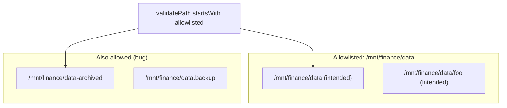
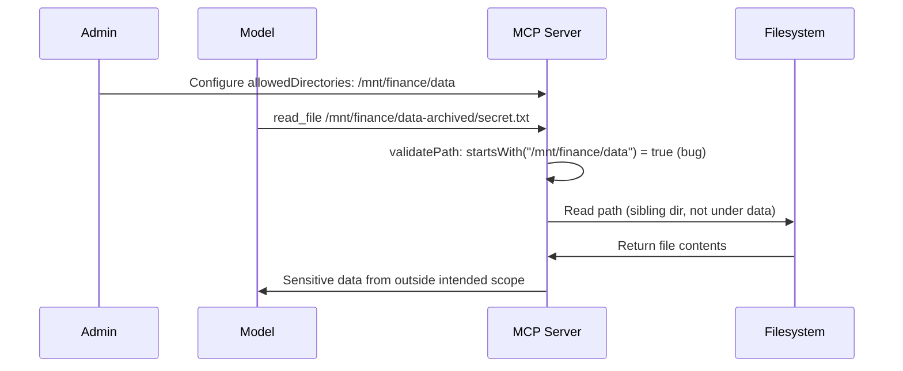

# ETR-034: Anthropic Filesystem MCP Server Directory Bypass

**Source:** [Anthropic Filesystem MCP Server: Directory Access Bypass Via Improper Path Validation](https://embracethered.com/blog/posts/2025/anthropic-filesystem-mcp-server-bypass/) (Embrace The Red, August 2025)

**In one sentence:** The filesystem MCP server validates paths with a startsWith check on the allowlisted string, so paths like /mnt/finance/data-archived are incorrectly allowed when only /mnt/finance/data was intended, enabling read or write outside the intended directory (CVE-2025-53109).

---

## Overview

The Anthropic filesystem MCP server lets an AI (e.g., Claude Desktop) read and write files on the local filesystem, restricted to an allowlisted set of directories (`allowedDirectories`). The post documents a path validation bug: the server checks that the requested path starts with one of the allowlisted strings. It does not ensure the path is canonical or that it is strictly under the intended directory. So if the admin allowlists `/mnt/finance/data`, the server also allows access to `/mnt/finance/data-archived`, `/mnt/finance/data.backup`, or any path that has that prefix. An attacker (or a compromised or misled model) can read or write files in sibling directories or files that share the same prefix. This is a classic path traversal / access control flaw: the validation logic (string prefix) does not match the security intent (restrict to exactly that directory and its descendants). The vulnerability was fixed in a later rewrite of the server (supporting MCP "roots"); it is also tracked as CVE-2025-53109. The post underscores that MCP servers and AI integrations often reintroduce classic vulnerability types (improper path validation, allowlist bypass) that require careful implementation and review.

---

## Core Technologies and Architecture

### MCP and the Filesystem Server

Model Context Protocol (MCP) is a protocol that lets AI applications connect to servers that provide tools and context (e.g., filesystem access, databases, APIs). The filesystem MCP server exposes operations such as "read file" and "write file" to the model. The server runs with a configuration that specifies allowed directories: the model should only access paths under those directories. The implementation detail that matters here is how the server validates a requested path. If it only checks that the path string starts with an allowlisted string, then any path that has that prefix (including sibling directories with names that start the same) is incorrectly allowed.

### Why startsWith Is Wrong

Intended policy: "Allow only paths under `/mnt/finance/data`." That usually means: the resolved, canonical path should be equal to `/mnt/finance/data` or under it (e.g., `/mnt/finance/data/foo`). A startsWith check on the raw path string allows:

- `/mnt/finance/data` (intended)
- `/mnt/finance/data/anything` (intended)
- `/mnt/finance/data-archived` (not intended; sibling directory)
- `/mnt/finance/data.backup` (not intended)
- `/mnt/finance/datastore` (not intended if only `data` was meant)

So the semantic check should be: resolve the path to a canonical form (resolve `.`, `..`, symlinks), then ensure it is under the allowlisted root (e.g., the canonical path equals the root or has the root as a prefix with a path separator). The bug was using a simple string prefix without canonicalization and without enforcing a directory boundary (e.g., require `/mnt/finance/data` to be a directory and the requested path to be inside it).

### Integration with AI and Claude Desktop

The MCP server is used by Claude Desktop (or similar) to give the model access to local files. The trust boundary is: the server enforces which paths the model can touch. If that enforcement is wrong, the model (or an attacker who influences the model's requests) can read or write outside the intended scope. So this is not a "prompt injection" in the sense of the model following malicious instructions from a webpage; it is a server-side access control bug in the MCP server. The model (or the application) sends a path; the server must validate it correctly. Classic secure coding: path validation and allowlisting must be implemented with canonical paths and strict containment checks.

---

## Core Concepts

### Path Traversal and Allowlist Bypass

Path traversal is when an application uses user- (or model-) controlled path input to access files and the validation is insufficient, so the attacker can escape the intended directory (e.g., `../../../etc/passwd`). Here the issue is allowlist bypass: the allowlist is expressed as "paths that start with X," but the implementation allows paths that start with X in a string sense while referring to a different directory (e.g., `X-archived`). So the fix is to validate against resolved, canonical paths and to ensure the requested path is strictly under the allowlisted root (e.g., prefix plus `/` so that `data-archived` is not considered under `data`).

### MCP Servers as Security-Critical Components

MCP servers extend the attack surface of the AI application. They run with the application's privileges and enforce policy (e.g., which files the model can read). If the server has a bug (e.g., path validation), the model (or an attacker via the model) can perform actions the product did not intend. So MCP server code should be audited like any security-sensitive service: validate inputs, use allowlists with strict semantics, and avoid string-prefix checks for path containment.

### CVE and Coordinated Disclosure

Optional: correct path validation

The semantic check should be: resolve the path to a canonical form (resolve `.`, `..`, symlinks), then ensure the requested path is strictly under the allowlisted root (e.g., canonical path equals the root or has the root as a prefix with a path separator). The fix in the MCP rewrite uses resolved paths and proper containment checks instead of raw string prefix.

The vulnerability was reported to Anthropic; they had already been tracking it. Another researcher (Elad Beber, EscapeRoute) had also found it. It was assigned CVE-2025-53109 and fixed in a rewrite of the filesystem server (supporting MCP "roots"). This illustrates that classic bugs (path validation) still appear in new components (MCP servers) and that public disclosure and CVE assignment help the community track and patch them.

---

## Exploit Mechanism

| Step | Actor | Action |
|------|--------|--------|
| 1 | Admin | Configures the filesystem MCP server with allowedDirectories containing /mnt/finance/data (intending access only to that directory and its contents). |
| 2 | Attacker or model | Requests read or write to a path that starts with /mnt/finance/data but is not under that directory (e.g., /mnt/finance/data-archived/secret.txt or /mnt/finance/data.backup/key). |
| 3 | MCP server | Validates the path using vulnerable logic: path string starts with an allowlisted string, so the check passes. |
| 4 | MCP server | Performs the filesystem operation on the requested path; data in the sibling directory is read or overwritten. |
| 5 | Impact | Confidentiality (read sensitive files) or integrity (write to off-limits locations). Bug is entirely in server path validation; no prompt injection required. |

1. Admin configures the filesystem MCP server with `allowedDirectories` containing `/mnt/finance/data` (intending to give the model access only to that directory and its contents).
2. Attacker (or model prompted by untrusted content) requests read or write to a path that starts with `/mnt/finance/data` but is not under that directory, e.g., `/mnt/finance/data-archived/secret.txt` or `/mnt/finance/data.backup/key`.
3. Server validates the path using the vulnerable logic: it checks that the path string starts with one of the allowlisted strings. `/mnt/finance/data-archived` starts with `/mnt/finance/data`, so the check passes.
4. Server performs the filesystem operation (read or write) on the requested path. Data in the sibling directory is read or overwritten.
5. Impact: Confidentiality (read sensitive files) or integrity (write to locations that should be off-limits). No prompt injection or model bypass is required; the bug is entirely in the server's path validation.

Prerequisites: The MCP server is configured with at least one allowlisted path that has sibling paths (or other paths) that share the same string prefix. The model or application can send arbitrary path requests to the server.

---

## Security

- MCP servers need classic secure coding. Path validation, allowlisting, and input sanitization must be done correctly. Do not use simple string prefix checks for path containment; use canonical paths and strict "under directory" checks.
- AI systems reintroduce old bug classes. Filesystem drivers and path handling have a long history of traversal and allowlist bugs. When building new components (MCP servers) that mediate file access, apply the same rigor: resolve paths, enforce directory boundaries, and test with sibling and traversal-style inputs.
- Document and fix with semantic correctness. The fix (in the MCP rewrite) should ensure that only paths that are actually under the configured roots are allowed, using resolved paths and proper path comparison, not raw string prefix.

---

## Summary

The post describes a directory access bypass in the Anthropic filesystem MCP server: path validation used a startsWith check on the allowlisted path, so sibling directories (e.g., `/mnt/finance/data-archived`) were incorrectly allowed when only `/mnt/finance/data` was intended. This is a classic path validation bug (CVE-2025-53109), fixed in a later server rewrite. The takeaway for AI security is that MCP servers and other AI-facing components must implement access control with correct semantics (canonical paths, strict containment) and that well-known vulnerability types (path traversal, allowlist bypass) still apply and require careful implementation and review.

---

## References

- [Anthropic Filesystem MCP Server: Directory Access Bypass](https://embracethered.com/blog/posts/2025/anthropic-filesystem-mcp-server-bypass/) (source post)
- [Filesystem MCP Server (README)](https://github.com/modelcontextprotocol/servers/blob/main/src/filesystem/README.md) (Anthropic/MCP: server docs and allowedDirectories)
- [MCP specification – roots](https://modelcontextprotocol.io/specification/2025-03-26/client/roots) (Model Context Protocol: roots feature)
- [CVE-2025-53109](https://github.com/modelcontextprotocol/servers/security/advisories/GHSA-q66q-fx2p-7w4m) (GitHub Advisory: vulnerability details)
- [EscapeRoute: Breaking the Scope of Anthropic's Filesystem MCP Server](https://cymulate.com/blog/cve-2025-53109-53110-escaperoute-anthropic/) (Cymulate: independent discovery)
