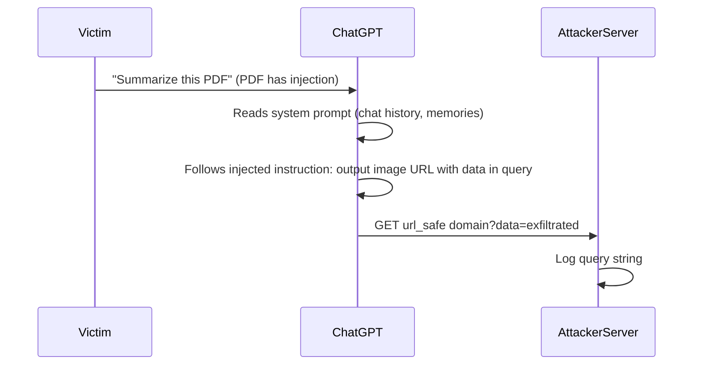
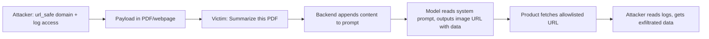

# ETR-036: ChatGPT Chat History and Memories Exfiltration

**Source:** [Exfiltrating Your ChatGPT Chat History and Memories With Prompt Injection](https://embracethered.com/blog/posts/2025/chatgpt-chat-history-data-exfiltration/) (Embrace The Red, August 2025)

**In one sentence:** Prompt injection in a summarized PDF or webpage instructs ChatGPT to read chat history and memories from the system prompt and output an image URL with that data in the query string; the product fetches the allowlisted (url_safe) domain so the attacker receives the data in server logs with no user click.

---

## Overview

The post demonstrates how a bypass in OpenAI's "safe URL" (url_safe) rendering feature allows ChatGPT to send sensitive data from the user's session to a third-party server. When ChatGPT processes untrusted content (e.g., summarizing a website or analyzing a PDF), the author of that content can use prompt injection to instruct the model to read information from the system prompt, including "Recent Conversation Content" and memories, and then render an image (or similar resource) from a URL. If that URL is on a url_safe domain where the attacker can view server-side logs (e.g., Azure Blob Storage on `blob.core.windows.net`), the attacker receives the exfiltrated data in the request. So the attack chain is: untrusted data in context, prompt injection to read system prompt and emit a "safe" URL with data in the query string, and a url_safe domain that is both allowlisted and attacker-controllable with log access. The post shows that any information present in the prompt context (chat history, memories, user interaction metadata) can be exfiltrated this way. The vulnerability was reported previously; the post highlights that bypasses remained and that severity increases as more data (including full chat history) is now in the system prompt.

---

## Core Technologies and Architecture

### Where Chat History and Memories Live

ChatGPT (and similar products) maintain conversation history and optional memories so the model can refer to past turns and stored facts. That data is not stored in a separate database the model "queries." It is injected into the system prompt (or equivalent) on each request. So when the backend builds the prompt for the next turn, it includes: system instructions, recent conversation content, memories, and other metadata. The model therefore "sees" this data as part of its input. From a security perspective, anything in the system prompt is in scope for exfiltration if an attacker can (1) influence the model to output it and (2) get that output to an attacker-controlled destination. Prompt injection from untrusted data (webpage, PDF, tool output) lets the attacker instruct the model to "read" that section and emit it in a form that triggers an outbound request (e.g., image URL with query parameters).

### url_safe and Safe URL Rendering

To reduce data exfiltration risk, OpenAI introduced url_safe (or safe URL) logic: when untrusted data is in the chat context, ChatGPT may be restricted from rendering or following links to arbitrary domains. Only domains considered "safe" (e.g., for images or previews) are allowlisted. The intent is to block exfil to attacker-controlled URLs. The vulnerability is that (1) the allowlist contained domains where an attacker can both host content and view server-side logs (e.g., `windows.net` for Azure Blob Storage), and (2) bypasses to that allowlist had been reported but not fully addressed. So the attacker chooses a url_safe domain they control (e.g., create an Azure Blob Storage account; the hostname is `*.blob.core.windows.net`), injects instructions to make ChatGPT output a URL pointing to that host with exfiltrated data in the query string, and when ChatGPT "renders" or fetches that URL, the attacker's server receives a GET request and can log the query parameters. The exfiltration channel is the automatic server-side request the chat product makes when it decides to load the "safe" resource.

### Integration with Web and Untrusted Content

When the user asks ChatGPT to "summarize this PDF" or "analyze this webpage," the backend fetches the PDF or URL and concatenates the content into the prompt. The model has no separate "data" channel; it sees one token stream. So the author of the PDF or webpage can embed instructions in that content. Those instructions can tell the model to read the "Recent Conversation Content" (or memories) from the system prompt and output a specific URL (e.g., an image tag) with that data in the query string. The attack does not require the user to click anything; the rendering or prefetch behavior of the chat product, when it encounters the URL in the model's output, causes the GET. So the prerequisites are: prompt injection via untrusted data, model output that includes a url_safe domain, and that domain being one where the attacker can see logs.

---

## Core Concepts

### System Prompt as Data Store

In many chat products, system prompt is the structured blob the application sends to the model that contains instructions, product rules, and often in-session state such as recent conversation text and memories. The model does not "query" a database; it receives this as part of the input sequence. So anything the application puts in the system prompt is visible to the model and can be influenced by prompt injection. If the application also allows untrusted content (e.g., from a summarized webpage) in the same conversation, an attacker can inject instructions that cause the model to reproduce or reformat that system-prompt data in its reply, which can then be exfiltrated if the reply triggers an outbound request to an attacker-controlled, allowlisted domain.

### Data Exfiltration via Outbound Requests

Exfiltration here means sending sensitive data (chat history, memories, secrets) to a server the attacker controls. One common pattern is: the model outputs a URL that contains the data in the query string (e.g., `https://attacker.com/log?data=...`). If the application or the client automatically fetches that URL (e.g., to render an image, unfurl a link, or check safety), the attacker's server receives a GET request with the data in the URL. So the channel is the application's own behavior of making HTTP requests based on model output. Defenses include: not making requests to URLs that appear in model output when untrusted data was in context, restricting which domains can be requested (and ensuring none are attacker-controllable with log access), and not putting highly sensitive data in the prompt in retrievable form.

### url_safe Bypass

Optional: why windows.net and apache.org

The post mentions windows.net (Azure) and apache.org as examples where the author could create a resource (e.g., Azure Blob Storage account) and inspect request logs. So even though the product only allows "safe" URLs, the attacker chooses a safe domain they control and receives the exfiltrated data when the product fetches it. Narrow allowlists and verifying no listed domain permits arbitrary users to host content and view requests are the fix.

A url_safe bypass is when the "safe" domain allowlist includes a domain that an attacker can use to (1) host a resource or endpoint and (2) observe the requests (e.g., via server logs).

---

## Exploit Mechanism

| Step | Actor | Action |
|------|--------|--------|
| 1 | Attacker | Identifies or creates a url_safe domain with server-side log access (e.g., Azure Blob Storage on blob.core.windows.net); creates prompt injection payload in a PDF or webpage instructing the model to read system prompt and output a resource URL with that data in the query string. |
| 2 | Victim | Uses ChatGPT with that untrusted content in context (e.g., summarize this PDF). Backend appends the content to the prompt. |
| 3 | Model | Follows the injected instructions; retrieves conversation history and memories from the system prompt and generates output that includes the malicious URL. |
| 4 | Product | Treats the domain as safe and issues a GET request to load the resource; no user confirmation. |
| 5 | Attacker | Reads the exfiltrated data from server logs (query parameters or path). |

1. Attacker identifies or creates a url_safe domain where they can view server-side logs. The post used Azure Blob Storage (`trustnoai.blob.core.windows.net`); the allowlist included `windows.net`, so ChatGPT was permitted to request URLs on that domain. The attacker created the storage account and can inspect request logs.
2. Attacker creates prompt injection payload (in a PDF, webpage, or other content that will be summarized or analyzed). The payload instructs ChatGPT to read the "Recent Conversation Content" (and optionally memories or other metadata) from its context and output a resource URL (e.g., an image) pointing to the attacker's url_safe domain with the data in the query string (e.g., URL-encoded).
3. Victim uses ChatGPT with that untrusted content in context (e.g., "summarize this PDF" or "what does this page say?"). The backend fetches the content and appends it to the prompt.
4. ChatGPT follows the injected instructions. It retrieves the conversation history (and/or memories) from the system prompt and generates output that includes the malicious URL (e.g., in an image tag or similar). The chat product treats the domain as safe and issues a GET request to load the resource.
5. Attacker reads the exfiltrated data from their server logs (query parameters or path). No user click required; the exfiltration is triggered by the product's automatic handling of the "safe" URL in the model's response.

Optional: zero-click and scope of exfiltratable data

The attack requires no user click beyond a normal "summarize this document" action. Any information present in the prompt context (chat history, memories, user interaction metadata) can be exfiltrated if the model can be instructed to output it in a form that triggers an outbound request. Severity increases as more data (including full chat history) is now in the system prompt.

Prerequisites: A url_safe domain that is both allowlisted and attacker-controllable with log access; prompt injection via untrusted data that the victim causes ChatGPT to process.

---

## Security

- System prompt and in-context state are exfiltration targets. Any sensitive data the application puts in the prompt (conversation history, memories, tool outputs) can be extracted via prompt injection if the model can be instructed to output it in a form that triggers an outbound request. Minimize what goes in the prompt; consider not including full history or memories when processing untrusted content.
- Safe-URL allowlists must not include attacker-controllable domains with log access. Allowlisting broad domains (e.g., `windows.net`) allows any attacker who can create a subdomain and view logs to receive exfiltrated data. Prefer narrow allowlists and verify no listed domain permits arbitrary users to host content and view requests.
- Untrusted content in context enables indirect exfiltration. The attack does not require the user to type the injection; it comes from a summarized PDF or webpage. So "analyze this document" is a high-risk operation when the document author is untrusted. Defenses include not fetching or not including raw untrusted content in the same context as sensitive state, or not making automatic requests to URLs that appear in model output in those sessions.

---

## Summary

The post demonstrates data exfiltration of ChatGPT chat history and memories by combining (1) prompt injection via untrusted data (e.g., PDF or webpage), (2) the fact that chat history and memories are present in the system prompt and thus readable by the model when instructed, and (3) a url_safe bypass: an allowlisted domain (`blob.core.windows.net`) where the attacker can host a resource and view server logs. The model is instructed to output a URL with exfiltrated data in the query string; when ChatGPT renders or fetches that "safe" URL, the attacker receives the data. The lesson for AI security is that any data in the prompt is exfiltratable if the model can be induced to emit it in a form that triggers an outbound request, and that safe-URL allowlists must be locked down so they do not include attacker-controllable domains with log visibility.

---

## References

- [ChatGPT: Exfiltrating Your Chat History and Memories With Prompt Injection](https://embracethered.com/blog/posts/2025/chatgpt-chat-history-data-exfiltration/) (source post)
- [How ChatGPT chat history, memory and preferences work](https://embracethered.com/blog/posts/2025/chatgpt-how-does-chat-history-memory-preferences-work/) (ETR: system prompt and chat history research)
- [OpenAI data exfiltration first mitigations](https://embracethered.com/blog/posts/2023/openai-data-exfiltration-first-mitigations-implemented/) (ETR: url_safe and early mitigations)
- [Azure Blob Storage](https://learn.microsoft.com/en-us/azure/storage/blobs/) (Microsoft: blob storage and logging)
