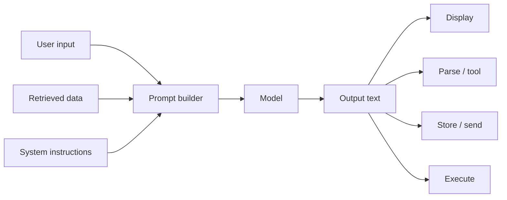
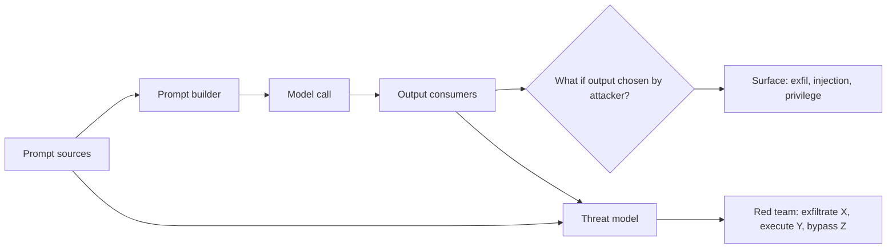

# ETR-099: MLSecOps Podcast – Threat Modeling and Red Teaming ML Systems

**Source:** [MLSecOps Podcast: AI Red Teaming and Threat Modeling Machine Learning Systems](https://embracethered.com/blog/posts/2023/mlsecops-podcast-ai-red-teaming/) (Embrace The Red, April 2023)

**In one sentence:** Threat model the full data flow (prompt sources, prompt builder, model call, output consumers) and red team with concrete goals (exfiltrate X, execute Y, bypass Z) so prompt injection, output abuse, and tool abuse are treated as structural issues, not one-off bugs.

---

## Overview

The post is a short pointer to an episode of the MLSecOps Podcast in which the author (Johann Reberger) discusses AI red teaming, machine learning security, and threat modeling of ML and AI systems. There is no technical exploit in the write-up itself. The value for students is conceptual: how to think about securing ML and AI applications and where prompt injection, abuse of generative models, and integration risks fit into a broader picture. This lesson expands on those ideas so you can threat model LLM-based applications and connect them to the rest of the ML and web stack.

---

## Core Technologies and Architecture

### Where ML and LLM Systems Sit in the Pipeline

A machine learning system in production usually has several stages: data ingestion, preprocessing, model training (or loading a pre-trained model), inference, and then consumption of the model’s output by the rest of the application. For LLMs used in chat or agents:

- Inference is the forward pass: prompt (tokenized) in, token stream out. The model itself has no network access, no database, no "tools" unless the application provides them. So the attack surface of the "model" is limited to what it can do with the prompt and what it outputs. But the application that wraps the model is what builds the prompt (from user input, retrieved documents, plugin output, system instructions) and uses the output (display, storage, tool calls, API requests). So threat modeling an "AI app" is really threat modeling the integration: where does untrusted data enter the prompt, and where does the model’s output go?

- Data flow: User message and optional context (history, fetched URLs, file contents) flow into the prompt. The prompt is sent to the model service (same process, same host, or remote API). The model returns text. That text may be (a) shown to the user, (b) parsed as structured data (JSON, commands), (c) sent to another service (e.g., email API, code executor), or (d) used to decide which tool to call and with what arguments. So the trust boundaries are: (1) everything that goes into the prompt (user + retrieved data + system instructions) and (2) everything that is done with the output. Threat modeling should enumerate both and ask: what if the prompt is adversarial? What if the output is adversarial?

### How This Connects to Web and Application Security

LLM-backed features are usually exposed via web or mobile clients. The client sends a request (e.g., POST with the user’s message and session ID). The backend (your server or a vendor’s) authenticates the user, loads conversation state, may call external APIs (search, fetch URL, read file), and assembles the prompt. So the backend is the place where untrusted data (user input, fetched web pages, plugin responses) is concatenated with trusted or semi-trusted data (system prompt, conversation history). That concatenation is the classic prompt-injection surface. The backend then calls the LLM API (over HTTPS, with an API key). The response is returned to the backend, which may again call other services (e.g., execute code, send email) based on the response. So the web part (HTTP, auth, session, CORS, same-origin) and the ML part (prompt construction, model call, output handling) are coupled. Threat modeling must cover both: e.g., "Can an attacker control the content of a fetched URL?" (indirect injection) and "If the model returns a URL, does our app fetch it?" (output injection / exfil).

Analogy: Threat modeling an LLM app is like threat modeling a web app that has one very powerful "oracle" (the model) in the middle. The oracle’s input is everything you put in the prompt; its output is text. The rest of the app decides what to put in and what to do with the text. So you need a data-flow diagram: sources of input (user, DB, HTTP fetch, plugins), the prompt builder, the model, and every consumer of the model’s output. Each edge is a potential abuse path.

---

## Core Concepts

### Threat Modeling in General

Threat modeling is a structured way to identify what can go wrong: assets (data, functionality), actors (users, attackers, other systems), trust boundaries, and data flows. You ask "what if this input is malicious?" and "what if this component is compromised?" For ML systems, the "model" is often a black box (you may not have weights or training data), so you focus on inputs and outputs: what can an attacker achieve by controlling the prompt, and what can they achieve by making the model output something specific that your app then uses?

### Red Teaming AI Applications

Red teaming is adversarial testing: try to break the system or achieve a specific harm (e.g., exfiltrate data, bypass safety, get the model to run unauthorized actions). For AI apps, red teaming includes: (1) prompt injection (direct and indirect) to override behavior or leak system prompts, (2) jailbreaks to get restricted content or personas, (3) abuse of tools (e.g., make the model call a tool with attacker-chosen arguments), (4) output abuse (make the model output a string that your app misuses, e.g., XSS or exfil URL). The podcast and the author’s work emphasize that these are not one-off bugs but structural issues: the way LLMs are integrated (single context, no privilege boundary, output used in sensitive contexts) creates recurring attack patterns. So red teaming should be continuous and should feed back into design (e.g., don’t put unfetched user content in the prompt; don’t execute model output as code).

### MLSecOps

MLSecOps (ML + Sec + Ops) is the practice of securing and operating ML systems in production: secure pipelines, access control to models and data, monitoring for abuse or drift, and incident response. For LLM-based apps, that includes: securing the API keys and backend that call the model, logging and monitoring prompt/response for abuse, and having a process for when someone finds a jailbreak or injection (e.g., prompt updates, output filters, or product changes).

---

## How This Post Fits the Corpus

| Step | Action |
|------|--------|
| 1 | Map prompt sources (user input, retrieved data, system instructions), prompt builder, model call, and every output consumer (display, parse/tool, store, execute). |
| 2 | For each consumer, ask: "What if the output were chosen by an attacker?" Surface output injection, exfil, and privilege issues. |
| 3 | Red team with concrete goals: exfiltrate X, execute Y, bypass Z. Test for those harms rather than only "break the prompt." |

The post does not describe a specific exploit. It points to a conversation about how to think about attacks and defenses for ML/AI systems. For your learning, the takeaway is: threat modeling and red teaming are the frameworks within which the other lessons (prompt injection, output trust, plugins, transcripts) sit. When you design or review an LLM integration, you should explicitly map: prompt sources, prompt builder, model call, output consumers. For each consumer, ask: "What if the output were chosen by an attacker?" That will surface output injection, exfil, and privilege issues. And when you test, try to achieve concrete harms (exfiltrate X, execute Y, bypass Z) rather than only "break the prompt"; that is red teaming.

Optional: red teaming checklist for AI apps

Red teaming for AI apps includes: (1) prompt injection (direct and indirect) to override behavior or leak system prompts, (2) jailbreaks to get restricted content or personas, (3) abuse of tools (make the model call a tool with attacker-chosen arguments), (4) output abuse (make the model output a string that your app misuses, e.g., XSS or exfil URL). These are structural issues: the way LLMs are integrated (single context, no privilege boundary, output used in sensitive contexts) creates recurring attack patterns. Red teaming should be continuous and feed back into design.

---

## Security

- Threat model the integration, not just the model. The model is one component. The prompt construction and output handling are where most vulnerabilities appear.
- Red team with clear objectives. Define "attacker goal" (e.g., read system prompt, exfiltrate conversation, run shell command) and test for it. That will drive you to indirect injection, output abuse, and tool abuse.
- MLSecOps: Treat LLM apps as production systems. Secure credentials, log and monitor, and have a response plan for new attack techniques (jailbreaks, injection variants).

---

## Summary

The post links to a podcast on AI red teaming and threat modeling ML systems. The lesson here is that threat modeling should cover the full data flow (inputs to the prompt, prompt construction, model call, uses of output) and that red teaming should be goal-based (exfiltrate, escalate, bypass). Understanding where LLM apps sit in the stack (web backend, APIs, plugins, output consumers) lets you apply the same rigor you would to any other application, with the added twist that both "input" and "output" of the model are attacker-influenced and must be treated as untrusted at the boundaries where they touch the rest of the system.
