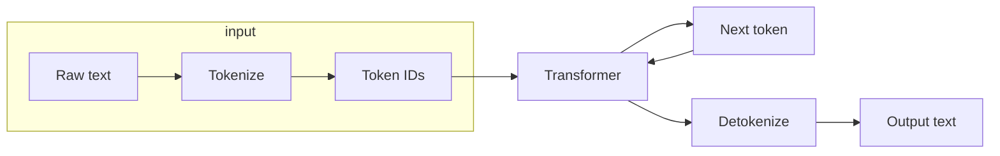
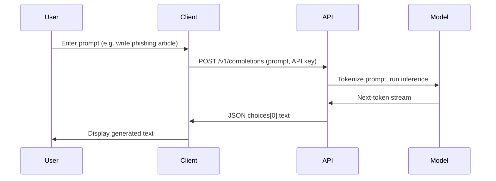
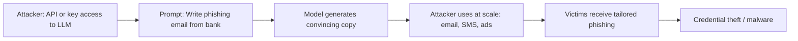

# ETR-105: GPT-3 and Phishing Attacks

**Source:** [GPT-3 and Phishing Attacks](https://embracethered.com/blog/posts/2022/gpt-3-ai-and-phishing-attacks/) (Embrace The Red, April 2022)

**In one sentence:** Generative language models can be used by attackers to create convincing, scalable phishing and social-engineering content; the same technology that helps users lowers the cost and raises the quality of attacks.

---

## Overview

The author asked GPT-3 to write a blog post about whether GPT-3 could be used for phishing. GPT-3 produced the entire article: an analysis of the risk, examples of how it could generate phishing emails and fake reviews, and even suggested countermeasures. At the end, the author revealed that none of the post was written by a human. The point is not that GPT-3 is "vulnerable" in the traditional sense. It is that generative language models can be used as a tool by attackers to create convincing, scalable phishing and social-engineering content. Understanding this is foundational for AI security: the same technology that helps users can lower the cost and raise the quality of attacks.

---

## Core Technologies and Architecture

### How LLMs Are Built: Transformers and Attention

Modern LLMs (including GPT-3) are built on the transformer architecture. You do not need to implement one to understand the security implications, but you do need a mental model of what the model actually does.

Tokens, not words: The model never sees raw text. Text is first tokenized (split into subword units that the model was trained on). A word like "phishing" might be one token or two ("phish" + "ing"). The model has a fixed vocabulary (e.g., 50k to 100k tokens). Every prompt and every generated response is a sequence of token IDs. So when we say "the model sees the prompt," we mean it receives a sequence of integers that index into this vocabulary. Any string that cannot be tokenized with that vocabulary is either split into the closest match or handled by a fallback. This matters for security because injection payloads are tokenized too; exotic unicode or obfuscation can sometimes change how instructions are tokenized and thus how the model weighs them.

Attention and context: The model is a stack of layers. Each layer has attention mechanisms: they let each token "look at" other tokens in the sequence and weight them by relevance. So the model can use the beginning of the prompt (e.g., system instructions) when generating the middle or end of the response. There is no separate "system" versus "user" memory; there is one sequence and attention over it. The total length the model can handle is the context window (e.g., 4k, 8k, 128k tokens). Everything that influences the next token must fit in that window. So when we say "system and user are concatenated," we mean literally: one long sequence of tokens, with no structural boundary the model enforces between "instructions" and "data."

Autoregressive generation: The model predicts the next token given all previous tokens. To generate a reply, the backend feeds the prompt (tokenized), gets one token out, appends it to the sequence, feeds again, and repeats until a stop condition (end-of-sequence token or max length). So generation is a loop: each new token depends on the entire prompt plus all tokens generated so far. There is no "execution" of instructions in a separate step; the model just continues the sequence in a statistically plausible way. That is why "ignore previous instructions" can work: the model is trained on text where such phrases often lead to a change in who is "in charge" of the conversation.

Training and capability: The model is pre-trained on a large corpus (web, books, code) to predict the next token. It learns grammar, facts, styles, and patterns (including "when someone says X, the next turn often does Y"). It was not trained with a formal notion of "obey the system prompt." Instruction-following is learned from examples in the data (e.g., "Assistant: ..." after "User: ..."). So the model’s "obedience" to system instructions is statistical, not enforced by architecture. That is why user input that looks like a new set of instructions can override the original ones.

### Where GPT-3 Sits in the Stack

When the author of the post used GPT-3 to generate the phishing article, the flow was:

1. Client (browser or script): The user (or attacker) sends a request. That could be the OpenAI Playground (a web app), a script using the API, or a custom frontend.
2. HTTP/HTTPS: The request goes over the web: method (e.g., POST), URL (e.g., `https://api.openai.com/v1/completions`), headers (often including `Authorization: Bearer <API_KEY>`), and body (JSON with model name, prompt, max_tokens, etc.).
3. Backend (OpenAI or your app): The server receives the request. If it is the vendor’s API, it validates the key, rate-limits, and may run input filters (e.g., blocklisted phrases). It then tokenizes the prompt and calls the model.
4. Model (inference): The actual LLM runs on GPU (or similar) hardware. It takes the token sequence, runs the transformer forward pass, and returns the next-token distribution (or samples from it). The backend loops to produce a full response, then detokenizes and returns text to the client.
5. Response: The client gets back JSON (e.g., `{ "choices": [{ "text": "..." }] }`) and displays or uses the text.

So the attack surface for "GPT-3 used for phishing" is: anyone who can authenticate (valid API key or access to a UI that uses one) can send prompts and receive generated text. There is no "vulnerability" in the API or model; the capability (generate fluent text on request) is the feature. Security implications are about who has access, what prompts they can send, and how the output is used (e.g., in phishing campaigns). Understanding this stack helps you see that defenses (e.g., rate limits, content policy, or output filtering) live in the HTTP/backend layer and in policy, not inside the model’s forward pass.

---

## Core Concepts

### What is an LLM?

A large language model (LLM) is a machine-learning system trained on huge amounts of text (books, articles, code, the web). It learns statistical patterns of language: which words tend to follow which, how sentences are structured, and how tone and topic relate. When you give it a prompt (a few sentences or a question), it generates what comes next, one token (word or subword) at a time. It does not "look up" answers. It predicts the most plausible continuation given what it has seen in training and what you just wrote.

Analogy: Think of an LLM as an extremely well-read person who has seen millions of documents and can finish your sentence in many plausible ways. They are good at sounding like a given style (formal email, tech blog, scam) because they have seen all of those. They do not "know" facts in a verifiable way; they reproduce patterns.

### What is GPT-3?

GPT-3 (Generative Pre-trained Transformer 3) is an LLM released by OpenAI in 2020. It has billions of parameters (the learned weights that define its behavior) and was trained on a broad internet-scale corpus. It can complete text, answer questions, write in a requested style, and follow instructions to a degree. The same family of technology led to ChatGPT (which adds conversation and safety tuning) and later models. For this lesson, the important idea is: any LLM that can generate fluent, on-topic text can be prompted to produce phishing-style content if the attacker knows how to ask.

### Phishing in One Sentence

Phishing is social engineering delivered through a channel (email, message, site) that tries to get the victim to trust the sender, click a link, or reveal data (passwords, credentials, PII). Classic defenses rely on cues: bad grammar, odd sender addresses, urgency, or "too good to be true" offers. When the content is generated by an LLM, it can be grammatically correct, tonally appropriate, and varied at scale, which undermines filters and user heuristics that assume human attackers write in limited, recognizable ways.

### Why "Abuse" Rather Than "Vulnerability"?

Optional: how the post was written

The author asked GPT-3 to write a blog post about whether GPT-3 could be used for phishing. GPT-3 produced the entire article: analysis of the risk, examples of how it could generate phishing emails and fake reviews, and suggested countermeasures. At the end, the author revealed that none of the post was written by a human. The point is that generative models can be directed to produce convincing, scalable phishing and social-engineering content.

Here there is no bug in the model or the API. The model is doing what it was designed to do: generate text that matches the prompt. The threat is that an adversary uses that capability for harmful purposes (phishing, disinformation, fake reviews). So we speak of abuse of generative AI or weaponization of LLMs. As an AI security engineer, you need to think both about (1) vulnerabilities in how systems use LLMs (e.g., prompt injection, data leakage) and (2) how LLMs can be used offensively. This post is about the second.

---

## Exploit Mechanism

| Step | Actor | Action |
|------|--------|--------|
| 1 | Attacker | Gets access to an LLM (public API, stolen key, or internal tool). Crafts a prompt that asks for phishing material (e.g., write a short email from a bank asking the user to confirm by clicking a link; use American English and sound professional). |
| 2 | Model | Generates one or many variants. Attacker can ask for different tones, lengths, or languages. |
| 3 | Attacker | Uses the output in real campaigns: emails, fake reviews, or copy on a phishing site. |
| 4 | Impact | Scalable, high-quality social engineering; credential theft or malware. No exploitation of a flaw in the model; the "exploit" is the pipeline (prompt design plus automation). |

1. Attacker gets access to an LLM. That might be the public API (paid or free tier), a stolen key, or an internal tool.
2. Attacker crafts a prompt that asks for phishing material: e.g., "Write a short email that appears to be from a bank, asking the user to confirm their account by clicking a link. Use American English and sound professional."
3. The model generates one or many variants. The attacker can ask for different tones, lengths, or languages.
4. Attacker uses the output in real campaigns: emails, fake review text, or copy on a phishing site.

There is no exploitation of a flaw in the model. The "exploit" is the pipeline: prompt design plus automation. The impact is scalable, high-quality social engineering that is cheaper and harder to detect by grammar or style alone.

---

## Security

- Generative models are dual-use. They improve productivity and assist users, and they can improve attackers’ productivity and assist fraud.
- Defenses cannot rely only on "obvious" bad writing. Training users and filters to spot LLM-generated phishing is a moving target; content can be tuned (e.g., "make it sound more human" or "add a few typos").
- Threat models should include "adversary with LLM access." Red teams and defenders should consider campaigns that use LLMs for content generation, not only for attacking the model itself (e.g., prompt injection).

---

## Summary

The post demonstrates that GPT-3 can produce a coherent, persuasive article about its own misuse. That illustrates a core idea: LLMs are powerful content generators that can be directed toward phishing and other social engineering. There is no patch for "don’t generate phishing text," because the same capability is general-purpose. Your job as an AI security engineer is to understand this abuse vector, design defenses (user education, filtering, detection of generated content where appropriate), and include it in threat models alongside vulnerabilities in how systems integrate and trust LLMs.

---

## References

- [GPT-3 and Phishing Attacks](https://embracethered.com/blog/posts/2022/gpt-3-ai-and-phishing-attacks/) (source post)
- [OWASP Top 10 for LLM Applications](https://owasp.org/www-project-top-10-for-large-language-model-applications/) (OWASP: LLM abuse and misuse risks)
